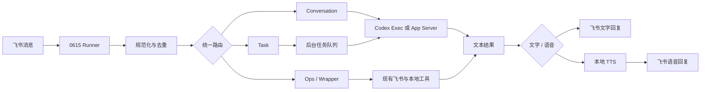

# 飞书机器人 Codex 路线升级方案（延期归档）

> 状态：搁置，不作为当前实现依据。
>
> 归档日期：2026-08-24。
>
> 上下文策略：本文件不加入 `docs/CONTEXT.md`；只有在明确讨论 Codex 路线升级时才读取。
>
> 原始方案：[飞书机器人-Codex路线升级方案.md](<C:/Users/ADMIN/Documents/飞书/飞书机器人-Codex路线升级方案.md>)。
>
> 原始文件 SHA-256：`5D7322F8C591F89CD94205899858DF5F50272D355DE3D45458C5F0E9E5CCA61A`。

## 归档说明

该方案保留“现有飞书机器人底座 + Codex 对话/任务执行层”的探索结论，但当前不实施、不切换线上 AI provider，也不新增 Codex task worker。现有 DeepSeek、包装确认状态机、语音和飞书工具链继续作为当前实现依据。

---
# 飞书机器人 Codex 路线升级方案

> 版本：v0.1
>
> 日期：2026-08-24
>
> 目标：在保留现有飞书消息、文档、包装素材和语音能力的基础上，引入图片中的本机 Codex conversation/task 双通道。

## 1. 方案结论

推荐采用“现有机器人底座 + Codex 对话执行器 + 后台任务队列”的混合方案，不重写飞书接入层。

现有机器人继续负责：

- 飞书事件接收、群聊 @ 判断和消息去重；
- 飞书文档、周报和包装素材等确定性工具；
- 飞书文字、语音消息发送；
- 现有权限、确认和日志边界。

新增 Codex 路线负责：

- 普通自然聊天（`conversation`）；
- 需要较长处理时间的后台工作（`task`）；
- 本机 ChatGPT/Codex 登录态复用；
- 对话上下文拼装和 Codex 会话管理。

核心链路：

```text
飞书消息
  -> 本机 0615 runner
  -> 消息规范化、去重、上下文读取
  -> conversation / task / chat / ops / wrapper 路由
  -> Codex exec / App Server / 现有本地工具
  -> 文字或语音结果
  -> 飞书回复
```

## 2. 当前实现基线

当前项目的主逻辑在 `lark-bot-listener.js`，PowerShell 文件主要负责启动和环境变量注入。

当前已经具备：

- `im.message.receive_v1` 事件监听；
- 私聊自动回复，群聊明确 @ 才回复；
- 消息去重、同一会话串行队列；
- `ping`、帮助、文档读取、周报和其他本地工具路径；
- DeepSeek、OpenAI 和 Ollama provider；
- 本地语音合成和歌曲生成命令；
- 飞书文字、音频回复及幂等键。

当前关键入口：

- provider 判断：`lark-bot-listener.js:127`；
- AI provider 调用：`lark-bot-listener.js:1482`；
- 路由回复：`lark-bot-listener.js:2065`；
- 飞书事件处理：`lark-bot-listener.js:2416`；
- 会话队列：`lark-bot-listener.js:2462`；
- 文字回复：`lark-bot-listener.js:2283`。

当前与图片路线的主要差距：

1. 没有 Codex adapter；
2. 普通聊天和后台任务没有统一拆分；
3. 没有全局任务队列和任务状态持久化；
4. 没有 `conversation / task / ops / wrapper` 统一路由结果；
5. 当前 `runProcess()` 的 stdin 为 `ignore`，不能直接把长 prompt 喂给 `codex exec -`；
6. 当前普通智能回复仍依赖 DeepSeek/OpenAI API 或本地 Ollama；
7. 当前日志已验证实际运行 provider 为 DeepSeek，例如 `logs/bot.log:1622`。

因此，本次升级的重点不是改造飞书 API，而是增加一层本机 AI 执行和任务编排。

## 3. 目标架构



### 3.1 飞书入口层

继续使用当前事件消费者，不更换消息接收协议。

入口层只做以下事情：

1. 解析 JSON 事件；
2. 检查事件类型；
3. 去重 `event_id`；
4. 检查机器人自身消息；
5. 检查群聊 @；
6. 标准化文本、作者、引用、回复关系和聊天 ID；
7. 把请求交给统一 runner。

历史消息只能作为上下文，不能直接当成要执行的指令。历史中的操作确认、命令和链接都必须重新经过当前消息的路由和权限判断。

### 3.2 统一请求对象

建议在进入路由器前统一成如下结构：

```js
{
  eventId,
  messageId,
  chatId,
  chatType,
  senderId,
  senderName,
  text,
  messageType,
  replyToMessageId,
  quoteMessageId,
  mentions,
  recentContext,
  receivedAt
}
```

不把整条飞书原始事件直接交给模型。这样可以控制上下文长度，也能避免把不必要的字段和内部信息发送给 Codex。

## 4. 路由设计

路由器先使用确定性规则，只有规则无法判断时才使用轻量语义判断。不要为每条普通消息先调用一次完整 Codex 做分类，否则会增加延迟和用量。

建议返回严格的 JSON：

```json
{
  "kind": "conversation",
  "output": "text",
  "priority": "normal",
  "needsHistory": true,
  "needsTools": false,
  "background": false
}
```

### 4.1 conversation

适用于：

- 日常聊天；
- 工具使用问题；
- 简短解释和建议；
- 不需要修改外部数据的自然语言请求。

执行策略：

- 同步等待最终文本；
- 目标 runner 等待时间不超过 20 秒；
- 默认只读权限；
- 注入近期上下文和回复规则；
- 生成完成后通过飞书原消息回复。

### 4.2 task

适用于：

- 预计超过实时窗口的整理、分析或代码工作；
- 需要读取多个文件或多份文档的工作；
- 需要后台执行、完成后再交付结果的工作。

执行策略：

- 创建任务记录；
- 使用全局队列限制并发，目标上限为 3；
- runner 不等待完整任务结果；
- worker 在后台运行 Codex；
- 任务完成后回复原消息或原线程；
- 任务失败、超时和取消都要有明确状态。

### 4.3 ops

适用于飞书文档、周报、日历、消息查询等平台操作。

这类操作继续优先使用现有 lark-cli 和确定性函数，不让 Codex 直接拼接任意 API 请求。Codex 可以负责理解用户意图和组织结果，但实际写入动作必须经过显式工具和权限检查。

### 4.4 wrapper

适用于包装素材检索、预览确认、源文件发送等已有业务流程。

包装流程继续保持：

- 项目名优先检索；
- 先发送候选预览；
- 只接受对候选消息的明确回复确认；
- 发送源文件前再次检查状态和权限；
- 不允许 Codex 绕过状态机直接发送文件。

### 4.5 chat

适用于 `ping`、帮助、身份介绍和固定短回复。这些请求直接本地返回，不调用 Codex。

## 5. Codex 执行器

### 5.1 conversation：优先使用 `codex exec`

对于一次性自然回复，使用 Codex CLI 的非交互模式：

```text
codex exec --ephemeral -
```

runner 通过 stdin 传入 prompt，通过 stdout 读取最终结果，通过 stderr 记录进度。不要把完整 prompt 拼到命令行参数中，避免进入进程列表和日志。

伪代码：

```js
async function callCodex(request) {
  const prompt = buildCodexPrompt(request);
  const child = spawn(CODEX_COMMAND, ["exec", "--ephemeral", "-"], {
    cwd: CODEX_WORKSPACE,
    env: buildCodexEnv(),
    stdio: ["pipe", "pipe", "pipe"],
    windowsHide: true,
  });

  child.stdin.end(prompt, "utf8");
  return await collectFinalMessage(child, CODEX_TIMEOUT_MS);
}
```

`codex exec` 适合普通聊天、摘要和一次性任务；官方文档说明它可以从脚本中非交互运行，并输出最终 agent message。[Codex 非交互模式](https://learn.chatgpt.com/docs/non-interactive-mode)

### 5.2 conversation：需要流式事件时使用 App Server

如果后续要实现：

- 流式展示进度；
- 多轮 Codex 会话；
- 审批事件；
- 工具调用事件；
- 更细粒度的中断和恢复；

再使用 `codex app-server`，由 0615 runner 通过本机 WebSocket 或 stdio 连接。App Server 是更适合外部产品深度集成的接口。[Codex App Server](https://learn.chatgpt.com/docs/app-server)

第一阶段不建议直接做流式飞书消息更新。先完成最终结果回复，再根据实际延迟决定是否增加进度卡片或消息更新。

### 5.3 task：后台 worker

后台任务可以先使用独立 `codex exec` 子进程实现，后续再考虑 SDK。

每个任务需要独立的：

- 工作目录；
- sandbox 权限；
- 超时时间；
- 日志上下文；
- 取消句柄；
- 结果和错误状态。

普通聊天使用只读权限。确实需要改文件时，使用专用工作区和 `workspace-write`，不要让后台 Codex 直接在主工作区执行不受控写入。

## 6. 认证与数据边界

### 6.1 两套认证必须分开

飞书机器人和 Codex 使用不同的登录态：

- 飞书认证：负责收发飞书消息和调用飞书工具；
- Codex 认证：负责本机 Codex 访问 OpenAI 模型。

图片路线中的“无需 API Key”只表示不要求用户提供 OpenAI Platform API Key，不表示没有认证。Codex CLI 使用 ChatGPT 登录时会复用本机保存的登录凭证。[Codex 认证](https://learn.chatgpt.com/docs/auth)

### 6.2 runner 启动要求

- runner 必须以完成 Codex 登录的 Windows 用户运行；
- 保持相同的 `CODEX_HOME`；
- 启动前执行 `codex login status` 检查登录态；
- 不把 `auth.json`、访问令牌或环境变量写入仓库；
- 不使用 SYSTEM 账户启动依赖个人登录态的 Codex 任务；
- 机器休眠、注销或网络中断时要能记录明确错误。

### 6.3 上下文发送边界

虽然不需要 API Key，但聊天内容仍可能被发送到 Codex 后端。建议增加显式开关：

```text
LARK_BOT_CODEX_CONTEXT_MODE=recent
LARK_BOT_CODEX_GROUP_HISTORY=off
LARK_BOT_CODEX_MAX_CONTEXT_CHARS=9000
```

默认只发送当前消息和必要的近期上下文。群聊历史、文档内容和个人信息不应无条件全部注入。

## 7. 任务状态与幂等

建议状态机：

```text
received
  -> classified
  -> queued
  -> running
  -> completed
  -> replied
```

异常状态：

```text
failed / timed_out / cancelled / expired
```

任务记录至少包含：

```text
task_id
event_id
message_id
chat_id
route_kind
status
created_at
started_at
finished_at
codex_session_id
result_summary
error_message
```

必须使用 `event_id` 或 `message_id + route_kind` 生成幂等键，避免事件重试导致重复回复或重复执行操作。

## 8. 目标配置

图片中的参数可以作为初始目标，但模型名应以当前 Codex 实际可用配置为准，不要把未验证的模型字符串写死。

| 配置项 | 建议初始值 | 说明 |
|---|---:|---|
| 实时回复路径 | Codex `exec` | 先返回最终文本，不做消息逐字流式更新 |
| 实时推理强度 | low | 优先延迟和自然度 |
| 服务档位 | fast | 仅在当前账号和 Codex 支持时启用 |
| 实时超时 | 20 秒 | 超时后返回可重试提示 |
| Codex bridge 超时 | 45 秒 | 保护 runner 不被子进程长期占用 |
| 后台并发 | 3 | 需要结合机器性能和账户限制调整 |
| 后台推理强度 | medium | 允许更完整的任务执行 |
| 普通聊天权限 | read-only | 不允许直接改主工作区 |
| 后台任务权限 | workspace-write | 仅限明确授权的专用目录 |
| 文字失败兜底 | 固定错误提示 | 按图片路线不切换本地聊天模型 |
| 语音合成 | 现有本地 TTS | 与文字模型解耦 |

建议新增环境变量：

```powershell
$env:LARK_BOT_AI_PROVIDER = "codex"
$env:LARK_BOT_CODEX_COMMAND = "codex"
$env:LARK_BOT_CODEX_MODE = "exec"
$env:LARK_BOT_CODEX_TIMEOUT_MS = "45000"
$env:LARK_BOT_CONVERSATION_TIMEOUT_MS = "20000"
$env:LARK_BOT_TASK_CONCURRENCY = "3"
$env:LARK_BOT_CODEX_SANDBOX = "read-only"
$env:LARK_BOT_CODEX_CONTEXT_MODE = "recent"
```

## 9. 分阶段实施计划

### Phase 0：基线和开关

目标：不改变现有线上行为。

- 增加 `codex` provider 名称，但默认关闭；
- 增加统一请求对象和路由决策日志；
- 为每条请求记录 `event_id`、路由、provider、耗时和结果状态；
- 保留当前 DeepSeek/Ollama 回滚路径。

验收：默认启动方式的回复内容和当前一致，旧测试全部通过。

### Phase 1：Codex 登录和单次探针

目标：确认本机 runner 可以调用 Codex，而不是只确认桌面应用存在。

- 完成 `codex login`；
- 执行 `codex login status`；
- 使用只读工作区运行一次固定 prompt；
- 验证 stdout、stderr、退出码和超时处理；
- 不接入飞书，不处理真实用户内容。

验收：不设置 OpenAI API Key 时，runner 能得到一条 Codex 最终文本。

### Phase 2：接入 conversation

目标：只替换普通自然聊天。

- 新增 `callCodex()`；
- 只让 `conversation` 路由进入 Codex；
- 保留 `ping`、帮助、周报、文档和包装操作的原路径；
- 默认只读和 20 秒实时超时；
- 失败时返回明确提示，不自动切换文字本地模型。

验收：私聊、群聊 @、短上下文和超时场景都能正确回复，未 @ 群消息不触发 Codex。

### Phase 3：接入 task worker

目标：把长任务从实时消息链路中拆出去。

- 增加任务队列和任务状态；
- 设置并发上限 3；
- 支持完成、失败、超时和取消；
- 任务结果回复原消息或原线程；
- 进程重启后能够发现未完成任务并标记为可恢复或失败。

验收：同时提交 4 个任务时，最多 3 个运行，其余排队；重复事件不会重复执行。

### Phase 4：接入 ops / wrapper 安全边界

目标：让 Codex 负责理解，现有工具负责执行。

- 文档和周报继续使用现有 lark-cli；
- 包装素材继续使用候选、预览、回复确认状态机；
- 所有写入和发送动作走显式工具；
- 对有副作用的动作保留用户确认和 `reply_to` 校验；
- 不允许 Codex 直接拼接任意 PowerShell 或飞书写入命令。

验收：Codex 可以正确识别用户意图，但未确认时不会发送文件、修改文档或执行高风险操作。

### Phase 5：语音和长期运行

目标：完成图片中的文字/语音分离和自动启动。

- 在路由阶段确定 `text` 或 `voice`；
- Codex 只负责生成文字内容；
- 语音交给现有本地 TTS；
- 将 Codex 环境变量接入 `lark-bot-listener.ps1` 和自动启动脚本；
- 增加启动探针、登录态检查和异常重启。

验收：语音请求只发音频；Codex 失败不会误发空音频；机器重启后 runner 可恢复。

## 10. 建议的代码拆分

当前主文件较大，建议新增模块，避免继续把所有逻辑堆进 `lark-bot-listener.js`：

```text
lib/
  route-policy.js       # conversation/task/ops/wrapper/chat 判断
  codex-adapter.js      # exec、超时、stdout/stderr、退出码
  codex-context.js      # prompt 和上下文长度控制
  task-queue.js         # 并发、状态、取消、恢复
  task-store.js         # 任务持久化
  output-router.js      # 文字、语音、错误结果
```

主 listener 只保留：

```text
接收事件 -> 标准化 -> 路由 -> 调用模块 -> 飞书回复
```

建议修改或新增的文件：

- `lark-bot-listener.js`：接入统一路由和模块；
- `lark-bot-listener.ps1`：增加 Codex 参数和启动检查；
- `start-feishu-bot-autostart.ps1`：透传 Codex 环境变量；
- `tests/lark-bot-listener.test.js`：增加路由和幂等测试；
- `lib/codex-adapter.js`：新增；
- `lib/task-queue.js`：新增；
- `README.md`：补充启动、认证、回滚和安全边界。

## 11. 监控与日志

每次请求记录结构化事件：

```text
route_decision event_id chat_id kind output needs_tools
codex_start event_id task_id mode timeout sandbox
codex_finish event_id task_id exit_code latency output_chars
reply_sent event_id message_id channel status
task_state task_id from to reason
```

禁止记录：

- API Key；
- Codex 登录令牌；
- `auth.json` 内容；
- 完整群聊历史；
- 未脱敏的敏感文档全文。

重点观察指标：

- conversation 平均和 P95 延迟；
- Codex 超时率；
- task 排队长度；
- 重复事件率；
- 飞书回复失败率；
- 语音生成失败率；
- Codex 登录失效次数。

## 12. 测试与验收清单

- [ ] 未设置 OpenAI API Key 时，Codex 登录态仍可完成一次探针；
- [ ] 私聊普通消息进入 `conversation`；
- [ ] 未 @ 的群消息不调用 Codex；
- [ ] @ 机器人后能读取限定长度的近期上下文；
- [ ] `ping`、帮助和固定指令不调用 Codex；
- [ ] 文档、周报和包装素材继续走现有工具；
- [ ] 普通聊天超时后不产生重复回复；
- [ ] 后台任务最多同时运行 3 个；
- [ ] 重复事件不会重复执行 task；
- [ ] task 完成后能回复原消息或原线程；
- [ ] 语音请求只发送音频；
- [ ] Codex 进程退出、网络失败和登录过期都有明确错误；
- [ ] 关闭 Codex provider 后可回滚到 DeepSeek 或 Ollama；
- [ ] 日志不包含密钥和完整敏感上下文。

## 13. 回滚方案

升级必须使用 feature flag，不能替换当前路径后再临时修复。

推荐保留：

```powershell
# 回滚到 DeepSeek
$env:LARK_BOT_AI_PROVIDER = "deepseek"

# 或回滚到本地 Ollama
$env:LARK_BOT_AI_PROVIDER = "ollama"

# 关闭所有智能回复，只保留本地规则和工具
$env:LARK_BOT_AI = "off"
```

出现以下情况时立即回滚：

- Codex 登录态频繁失效；
- 实时回复 P95 超过 20 秒；
- task 重复执行或无法取消；
- wrapper 确认边界被绕过；
- 敏感群聊上下文被误发送；
- Codex 子进程无法稳定退出。

## 14. 最终判断

图片路线适合作为当前机器人的“AI 执行层升级”，不适合作为整套飞书机器人重写方案。

最稳妥的落地顺序是：

```text
保留飞书底座
  -> 新增 Codex 单次调用
  -> 只替换普通 conversation
  -> 增加 task worker
  -> 接入 ops / wrapper 权限边界
  -> 最后再考虑 App Server 流式能力
```

这样可以先获得更自然的 Codex 聊天能力，同时保留当前机器人已经验证过的飞书工具、包装素材流程、语音能力和回滚路径。
