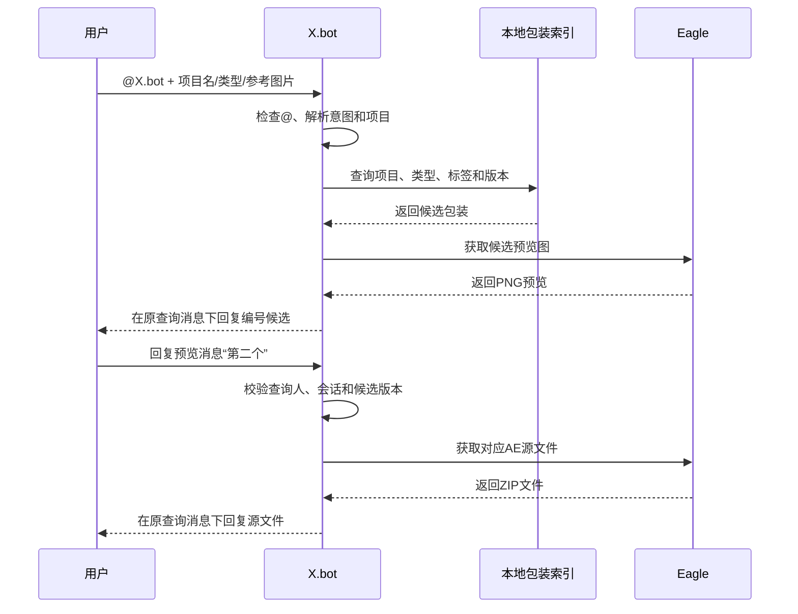

# 飞书机器人包装素材检索项目文档

## 1. 文档信息

| 项目 | 内容 |
| --- | --- |
| 项目名称 | X.bot 包装素材检索 |
| 文档版本 | v1.2 |
| 当前状态 | 需求及技术方案确认 |
| 使用平台 | 飞书、Eagle、After Effects |
| 核心目标 | 在飞书中快速查找包装预览，并在用户确认后发送对应 AE 源文件 |

## 2. 项目背景

包装素材目前主要存放在 Eagle 中，包含预览图片和对应的 AE 源文件。随着项目和包装数量增加，仅依靠人工翻找文件夹、回忆文件名或在群聊中询问，会产生以下问题：

- 同一套包装可能被多个项目重复使用，难以通过文件名快速定位。
- 人名条、标注条等元素经常混合使用，分类边界不固定。
- 部分项目会在通用包装基础上修改，容易混淆基础版和项目修改版。
- 预览图与 AE 源文件如果只靠同名文件关联，改名或移动后容易失效。
- 发送人通常只记得项目名或看到的画面，不一定知道准确素材名称。

本项目计划在现有 X.bot 中增加包装素材检索能力，让用户在飞书中通过项目名、包装类型或参考图片查找素材。机器人先返回静态预览，用户确认后再发送源文件，降低误发风险。

## 3. 项目目标

### 3.1 核心目标

1. 用户在飞书中通过 `@X.bot` 发起包装查询。
2. 机器人支持项目名、包装类型、自然语言和参考图片等输入。
3. 机器人从 Eagle 素材库中查找候选包装，并回复静态 PNG 预览图。
4. 用户通过回复消息确认候选，不使用交互卡片。
5. 机器人将对应 AE 源文件压缩包回复在最初的查询消息下面。
6. 保证预览图、包装版本、AE 工程和合成名称之间的对应关系准确。
7. 支持从 AE 项目工程中选择可复用包装合成，整理预览、工程依赖和元数据后进入 Eagle 待入库流程。

### 3.2 非目标

第一阶段不包含以下能力：

- 自动修改 AE 工程中的文字、颜色或尺寸。
- 在飞书中直接预览 AE 动画。
- 完全依赖图片识别并自动发送唯一源文件。
- 建立海外版、竖屏版、阶段版等复杂项目层级。
- 替代 Eagle 的素材整理和人工审核功能。
- 在第一阶段开发 Eagle 插件式自动入库；该能力安排在后续版本迭代。
- 在第一阶段自动判断 AE 工程中哪些合成具有复用价值；包装合成仍由制作人员明确选择。

## 4. 包装范围

包装素材主要分为以下四类：

| 类型 | 说明 | 常见标签 |
| --- | --- | --- |
| 信息条 | 包含人名条、标注条，以及两者混合使用的样式 | 人物、姓名、职位、地点、参数、说明、重点标注 |
| 视频框 | 用于承载视频、图片或局部画面的框体 | 横框、竖框、多画面、圆角、描边 |
| 背景 | 完整画面背景或包装背景层 | 主背景、过渡背景、章节背景 |
| 分镜排版 | 多画面组合、对比排版和完整镜头布局 | 双屏、三屏、对比、时间线、信息组合 |

人名条和标注条统一归入“信息条”，不强制拆成互斥类别。具体用途通过标签记录，同一个包装可以同时拥有“人物”和“标注”等多个标签。

## 5. Eagle 素材组织

### 5.1 文件夹结构

Eagle 中建立两个顶层文件夹，并按照包装类型设置子文件夹：

```text
包装素材库
├─ 01_预览图
│  ├─ 信息条
│  ├─ 视频框
│  ├─ 背景
│  └─ 分镜排版
└─ 02_AE源文件
   ├─ 信息条
   ├─ 视频框
   ├─ 背景
   └─ 分镜排版
```

### 5.2 预览图规范

- 预览图统一使用静态 PNG。
- 信息条、视频框等叠加元素使用透明底 PNG。
- 背景和完整分镜排版使用 PNG 保存实际画面内容。
- 预览图应避免无关画面干扰，确保包装结构可以被快速辨认。
- 同一包装的不同修改版本分别生成预览图，不覆盖旧版本。

### 5.3 源文件规范

- 源文件默认使用 ZIP 压缩包发送，不直接发送裸 `.aep`。
- ZIP 应包含 AE 工程及其依赖素材，避免工程打开后丢失链接。
- 多个包装可以共用一个 AE 工程，但每条包装记录必须填写对应的 AE 合成名称。
- 源文件更新后需要同步更新版本号和索引，不允许只替换文件而不留版本记录。

### 5.4 命名建议

```text
预览图：项目_包装类型_包装名称_版本.png
源文件：项目_包装名称_版本.zip
```

示例：

```text
阿宝_信息条_人物信息条_v02.png
阿宝_人物信息条_v02.zip
```

文件名用于人工识别，不作为机器人建立对应关系的唯一依据。

### 5.5 AE 包装提取与待入库交付规范

AE 包装提取是 Eagle 入库的上游环节，目标是把包含大量业务镜头和依赖素材的完整项目工程，整理成一个包装对应一个可审核的待入库单元。

- 制作人员在 AE 的 Project 面板中明确选择需要复用的包装合成，并填写或确认项目、包装名称、类型和版本。
- 所有精简、依赖收集和重命名操作都在工程副本或收集副本上完成，不直接修改原始项目工程。
- 每个包装选择一个具有代表性的预览帧并生成静态 PNG；信息条和视频框等叠加元素应保留透明背景。
- 依赖收集优先使用 AE 的 `File > Dependencies > Collect Files`，按选中合成收集实际依赖；只有通过安全检查后才在收集副本上使用 `Reduce Project`。
- 收集完成后保留 AE 生成的 Report。Report 中的合成、字体、效果和素材依赖用于入库预检，但不代替实际打开工程验证。
- 收集目录压缩为 ZIP，并与 PNG、manifest 一起进入按项目组织的 `00_待入库` 文件夹。
- 跨合成表达式引用、缺失素材、第三方效果、字体和无法判断用途的示例素材必须显示为人工复核项，不能静默忽略。
- 自动配对失败时保留待入库状态，不根据时间戳或相似文件名直接建立正式映射。

建议的待入库结构：

```text
00_待入库
└─ 变速箱
   ├─ manifest.json
   ├─ 变速箱_信息条_小标注_v01.png
   ├─ 变速箱_小标注_v01.zip
   ├─ 变速箱_背景_黑色纹理背景_v01.png
   ├─ 变速箱_黑色纹理背景_v01.zip
   ├─ 变速箱_视频框_横向单画面框_v01.png
   └─ 变速箱_横向单画面框_v01.zip
```

manifest 至少为每条包装记录以下内容：

| 字段 | 说明 |
| --- | --- |
| `manifest_version` | manifest 结构版本 |
| `package_id` | 本次提取生成或沿用的包装唯一 ID |
| `source_project_name` | 原 AE 项目名称，用于追溯，不作为检索主键 |
| `project_name` | 对外检索使用的项目名称 |
| `package_name` | 包装名称 |
| `package_type` | 信息条、视频框、背景或分镜排版 |
| `version` | 包装版本 |
| `ae_comp_name` | 用户选择的 AE 合成名称 |
| `preview_time` | 预览图对应的合成时间点 |
| `preview_file` | 待入库 PNG 文件名 |
| `source_file` | 待入库 ZIP 文件名 |
| `fonts` | Report 检出的字体依赖 |
| `effects` | Report 检出的效果和第三方插件依赖 |
| `dependency_status` | 完整、警告或阻止入库 |
| `created_at` | 提取时间 |

## 6. 包装数据模型

Eagle 负责素材保存和日常管理，机器人使用独立的本地索引保存稳定映射。建议第一版使用 SQLite。

### 6.1 核心字段

| 字段 | 说明 |
| --- | --- |
| `package_id` | 包装唯一 ID |
| `project_id` | 所属项目 ID |
| `project_name` | 项目名称 |
| `project_aliases` | 项目简称和常用别名 |
| `package_name` | 包装名称 |
| `package_type` | 信息条、视频框、背景或分镜排版 |
| `tags` | 用途、视觉特征和近义词标签 |
| `version` | 当前版本号 |
| `base_package_id` | 基础包装 ID，原创版本可为空 |
| `preview_eagle_id` | Eagle 中的预览图 ID |
| `source_eagle_id` | Eagle 中的源文件 ID |
| `source_path` | 可验证的源文件路径或插件返回路径 |
| `ae_comp_name` | 对应 AE 合成名称 |
| `status` | 启用、停用或归档 |
| `updated_at` | 最近更新时间 |

### 6.2 多项目复用

同一包装可以关联多个项目。项目和包装之间采用多对多关系，不为每个项目重复保存一份相同源文件。

项目修改版需要建立新的包装版本，并通过 `base_package_id` 指向原包装。例如：

```text
通用人物信息条 v01
└─ 阿宝项目人物信息条 v02
   └─ 阿宝项目人物信息条 v03
```

检索项目包装时优先返回该项目的修改版；没有修改版时再返回关联的通用版本。

## 7. 查询与触发规则

### 7.1 触发条件

所有新的包装查询都必须明确 `@X.bot`，包括私聊和群聊。未 `@X.bot` 的新消息不触发包装检索。

示例：

```text
@X.bot 查阿宝项目的包装
@X.bot 找阿宝项目的信息条
@X.bot 找这张图片里的包装
图片 + “@X.bot 阿宝项目”
```

查询进入确认阶段后，原查询人回复候选消息时不需要再次 `@X.bot`。

### 7.2 模糊输入

机器人需要容忍以下输入变化：

- 项目简称、历史名称和常用别名。
- 少量错别字或缺字。
- “人名条、人物条、姓名条”等近义表达。
- “阿宝那个标注”“找一下阿宝的框”等自然语言。
- “第一个、第一张、1、就这个”等确认表达。

模糊匹配只能用于召回候选，不能绕过用户确认直接发送源文件。

## 8. 检索策略

候选包装按照以下优先级排序：

1. 项目名称精确匹配。
2. 项目别名和项目名称模糊匹配。
3. 项目关联包装中的类型和标签匹配。
4. 参考图片与候选预览图的相似度。
5. 历史使用记录、常用程度和更新时间。

当用户提供“图片 + 项目名”时，只在该项目关联的包装范围内进行图片识别。没有项目名时，图片识别作为辅助召回方式，机器人应返回多个候选，不直接判断唯一答案。

图片识别不依赖 Eagle 内置 AI 搜索作为第一版核心能力。Eagle 负责素材存储和普通查询，视觉相似度由独立的本地或外部识别模块提供。

## 9. 消息流程

### 9.1 标准流程



### 9.2 候选回复示例

```text
找到 2 个候选包装：

1. 阿宝人物信息条 · 修改版 02
[透明 PNG 预览]

2. 阿宝通用标注条 · 通用版
[透明 PNG 预览]

请回复“第一个”“第二个”或“都不是”。
```

### 9.3 用户确认

支持以下确认表达：

```text
确认
就是这个
发源文件
第一个
第二张
2
```

支持以下继续检索表达：

```text
不是
换一个
都不对
找信息条
再看看背景
```

为了避免把群聊普通对话误判为确认，用户应回复机器人发出的候选预览消息。机器人只接受原查询人的确认。

### 9.4 源文件回复

- 用户确认后，机器人先回复简短确认结果。
- AE 源文件 ZIP 必须回复在最初的查询消息下面。
- 预览消息、确认消息和源文件通过原查询消息 ID 建立关联。
- 同一确认重复发送时，不重复上传源文件。

## 10. 查询状态管理

每次查询至少保存以下状态：

| 字段 | 说明 |
| --- | --- |
| `request_id` | 查询唯一 ID |
| `requester_id` | 原查询人 |
| `chat_id` | 所在会话 |
| `root_message_id` | 最初查询消息 ID |
| `preview_message_ids` | 候选预览消息 ID |
| `candidate_package_ids` | 当前候选及排序 |
| `selected_package_id` | 已选择的包装版本 |
| `status` | 查询中、待确认、发送中、已完成或已过期 |
| `expires_at` | 查询过期时间 |

建议待确认状态保留 20 分钟。超时后用户需要重新 `@X.bot` 发起查询。

## 11. 技术架构

```text
入库链路：
AE 原始项目
    ↓ 人工选择包装合成
AE 包装提取辅助工具
    ↓ PNG + ZIP + manifest + 依赖报告
00_待入库 / Eagle 入库助手
    ↓ 人工审核并通过官方 API 写入
Eagle 素材 + SQLite 稳定映射

检索链路：
飞书消息事件 → @X.bot 触发判断 → 查询意图与可选视觉识别
    → SQLite 包装索引 → Eagle 素材
    → 预览候选 → 原查询人确认 → ZIP 回复原消息
```

### 11.1 AE 侧

AE 包装提取辅助工具负责：

- 读取制作人员明确选择的包装合成和指定预览时间点。
- 生成规范化 PNG 预览，并保留透明通道要求。
- 引导或执行基于选中合成的依赖收集，在副本上精简工程并生成 ZIP。
- 读取 AE 收集报告中的合成、字体、效果和素材依赖。
- 生成标准化 manifest，并将风险标记为完整、警告或阻止入库。
- 保证任何自动处理都不覆盖原始 `.aep` 和原始项目素材。

AE 辅助工具不负责判断某个合成是否具有业务复用价值，也不负责把素材直接写入 Eagle 正式目录。

### 11.2 飞书侧

飞书负责：

- 接收文字和图片消息事件。
- 获取 `@X.bot`、发送人和消息上下文。
- 下载用户发送的参考图片。
- 在指定消息下回复 PNG 和 ZIP 文件。
- 接收用户对候选预览的文字回复。

### 11.3 Eagle 侧

Eagle 负责：

- 保存和管理预览 PNG、AE 源文件 ZIP。
- 提供文件夹、标签和素材的普通查询。
- 提供预览图及源文件定位能力。
- 审核 AE 辅助工具生成的 manifest、配对结果和依赖状态。

Eagle Web API 普通素材列表不应被假定始终包含稳定的原始文件路径。源文件路径可通过本地索引保存，或通过一个小型 Eagle 后台插件读取官方 Plugin API 的 `filePath`。

### 11.4 机器人服务

机器人服务负责：

- 触发规则和意图识别。
- 项目、包装、版本和文件映射。
- 模糊搜索和候选排序。
- 图片相似度模块的调用。
- 查询状态、权限和重复发送控制。
- 运行日志、错误提示和健康检查。

## 12. 异常与边界处理

| 情况 | 处理方式 |
| --- | --- |
| 没有 `@X.bot` | 不触发新的包装查询 |
| 未识别项目名 | 提示补充项目名，或返回少量可能项目供文字确认 |
| 没有候选 | 提示未找到，并给出识别到的项目和类型 |
| 候选过多 | 优先按项目和类型缩小范围，首轮最多返回 3 个 |
| 图片中有多个包装 | 按类型分组返回候选，并要求用户说明要找哪一个 |
| 其他人回复“确认” | 不发送源文件，提示由原查询人确认 |
| 查询已过期 | 提示重新 `@X.bot` 发起查询 |
| Eagle 未运行 | 提示素材库暂时不可用，并记录错误 |
| 预览存在但源文件缺失 | 不进入可确认状态，提示素材映射异常 |
| AE 合成存在跨合成表达式引用 | 禁止无提示精简，要求人工检查收集副本 |
| Report 检出缺失字体或第三方效果 | 标记依赖警告，审核人确认后才能启用 |
| ZIP 含明显无关示例素材 | 保留待入库状态，返回 AE 侧清理后重新提取 |
| manifest 与 PNG/ZIP 无法唯一配对 | 阻止正式入库，不使用时间戳猜测映射 |
| ZIP 上传失败 | 保留查询状态，允许原查询人重试 |
| 重复确认 | 返回已发送状态，不重复上传 |

## 13. 权限与安全

- 机器人只能发送已启用且映射完整的源文件。
- 源文件在群聊中回复后，群内成员可能均可查看，因此需要继承当前项目的群聊访问边界。
- 如后续出现敏感项目，可为项目增加允许群聊或允许用户列表。
- 日志不记录飞书密钥、Eagle API Token 或源文件完整内容。
- 图片识别如果调用外部 AI 服务，需要单独确认图片是否允许上传到外部服务。
- AE 提取工具只对本地工程副本执行写操作，不上传工程、预览或依赖素材到外部服务。

## 14. 素材入库检查

新增或更新包装时，应完成以下检查：

- [ ] 包装合成由制作人员明确选择，原始 AE 工程未被精简或覆盖。
- [ ] 已按选中合成收集依赖，ZIP 中没有明显无关的业务视频或示例截图。
- [ ] 已放入正确的 Eagle 文件夹。
- [ ] 已生成对应静态 PNG 预览。
- [ ] 透明叠加元素保持透明背景。
- [ ] 已准备包含依赖素材的 AE 源文件 ZIP。
- [ ] 已生成 manifest，并能唯一配对 PNG、ZIP 和 AE 合成。
- [ ] 已检查 Report 中的字体、效果、第三方插件和缺失素材。
- [ ] 已填写项目、包装类型、标签和版本。
- [ ] 修改版已关联基础包装。
- [ ] 已填写 AE 合成名称。
- [ ] 预览图和源文件均能被机器人读取。
- [ ] 在测试群完成一次查询、确认和源文件发送。

## 15. 实施阶段

### 第一阶段：文字检索闭环

- 建立 Eagle 文件夹和 SQLite 索引。
- 实现 `@X.bot` 包装查询触发。
- 支持项目名、项目别名、包装类型和标签检索。
- 回复静态 PNG 候选。
- 通过用户文字回复确认。
- 将 ZIP 回复在原查询消息下面。

### 第二阶段：版本与模糊输入

- 支持通用包装、多项目复用和项目修改版。
- 完善错别字、别名和近义词匹配。
- 增加入库校验、查询过期、权限和幂等处理。

### 第三阶段：图片识别

- 下载飞书参考图片。
- 识别画面中的包装区域和包装类型。
- 在指定项目候选中进行相似度排序。
- 没有项目名时返回多个候选，不自动发送源文件。

### 第四阶段：运行保障

- 配置机器人和 Eagle 依赖的启动检查。
- 增加断线重连、失败重试和健康状态日志。
- 根据真实使用记录优化候选排序和近义词表。

### 第五阶段：AE 包装提取与 Eagle 入库工具链

- 开发 AE 包装提取辅助工具，读取用户选择的包装合成和指定预览帧。
- 在工程副本上按选中合成收集依赖、精简工程，并输出 PNG、ZIP、Report 和 manifest。
- 检查跨合成表达式、缺失素材、字体、第三方效果和明显无关的示例素材。
- 开发 Eagle 窗口插件，扫描 `00_待入库` 下按项目建立的文件夹。
- 自动识别 PNG 预览图、AE 源文件 ZIP 和 manifest，并按 `package_id`、项目、包装名称和版本进行配对。
- 在插件界面展示待入库清单、缺失字段、配对冲突和异常文件。
- 支持人工补充包装类型、标签、版本、AE 合成名称和基础包装关系。
- 用户确认后，将 PNG 和 ZIP 分类到正式目录并添加对应标签。
- 将预览图 Eagle ID、源文件 Eagle ID、项目、版本和合成名称写入 SQLite 索引。
- 入库成功后移出待入库状态；资料不全或配对失败的文件继续保留并提示处理。
- 飞书消息接收、候选确认和源文件发送仍由 X.bot 服务负责，插件不替代机器人服务。

## 16. 验收标准

### 16.1 第一阶段验收

- [ ] 未 `@X.bot` 的新查询不会触发包装检索。
- [ ] `@X.bot 找阿宝项目的信息条` 能返回正确项目的候选预览。
- [ ] 项目别名和常见包装近义词可以命中正确候选。
- [ ] 每个候选均显示包装名称、版本和 PNG 预览。
- [ ] 原查询人回复“第二个”后能选择正确版本。
- [ ] 其他成员回复“确认”不会触发源文件发送。
- [ ] 确认后对应 ZIP 回复在最初的查询消息下面。
- [ ] 重复确认不会重复上传源文件。
- [ ] 查询超时后不会继续发送旧候选的源文件。

### 16.2 图片识别阶段验收

- [ ] “图片 + 项目名”只检索该项目关联的包装。
- [ ] 能对信息条、视频框、背景和分镜排版进行候选分类。
- [ ] 识别不确定时返回最多 3 个候选并等待确认。
- [ ] 图片识别结果不会绕过确认直接发送源文件。

### 16.3 AE 提取与 Eagle 入库阶段验收

- [ ] 从一个真实 AE 项目中选择三个包装合成后，生成三条独立待入库记录。
- [ ] 原始 AE 项目的内容、路径和修改时间不因提取流程发生变化。
- [ ] 每条记录均包含可辨认的 PNG、可打开的 ZIP、AE 合成名称和 manifest 元数据。
- [ ] ZIP 只包含选中合成实际需要的工程和依赖；无法安全裁剪的跨合成引用会显示警告。
- [ ] Report 中的字体、第三方效果、缺失素材和依赖数量能够在审核界面查看。
- [ ] manifest、PNG 或 ZIP 缺失、重复或冲突时不能进入 Eagle 正式目录。
- [ ] 用户确认后，Eagle ID、版本、合成名称和源文件路径正确写入 SQLite。

## 17. 风险与应对

| 风险 | 影响 | 应对方式 |
| --- | --- | --- |
| 完整截图中的包装占比小 | 图片相似度不稳定 | 项目名优先、局部识别、返回候选确认 |
| 包装改色、缩放或换字 | 无法直接像素匹配 | 使用结构特征或视觉向量，不做纯像素比较 |
| 文件移动或改名 | 预览与源文件映射失效 | 使用 Eagle ID 和独立索引，不依赖同名文件 |
| 多版本并存 | 容易发送旧版 | 保存基础版本关系，项目修改版优先 |
| AE 工程缺少依赖 | 文件无法直接使用 | 统一发送包含依赖的 ZIP，并在入库时检查 |
| 直接精简原 AE 工程 | 原工程内容丢失或引用损坏 | 只处理工程副本或收集副本，禁止覆盖原工程 |
| 跨合成表达式被精简 | 包装动画报错或表现变化 | 检出风险后阻止自动通过，并要求人工打开收集副本验证 |
| 字体或第三方插件缺失 | 接收方打开工程后样式或效果错误 | 从 Report 提取依赖并在预览、入库和发送时展示警告 |
| 收集包混入业务素材 | ZIP 过大或误发项目内容 | 按选中合成收集依赖，审核明显无关视频和截图 |
| 群聊误确认 | 发送错误源文件 | 要求回复候选消息，并校验原查询人 |
| Eagle 或事件监听未运行 | 查询不可用 | 启动检查、健康日志和自动重连 |

## 18. 最终方案结论

项目采用“AE 侧标准化提取、Eagle 审核入库、项目名优先检索、图片识别辅助、预览后确认”的完整链路。AE 辅助工具把用户选择的包装合成整理为 PNG、ZIP、Report 和 manifest；Eagle 继续作为素材库；SQLite 保存稳定的项目、包装、版本、预览和源文件映射；飞书负责消息接收、预览回复、用户文字确认和源文件发送。

第一阶段优先完成文字查询闭环，可以在不依赖图片 AI 识别的情况下投入实际使用。图片识别在基础数据和真实查询样本稳定后接入，用于缩小候选范围，而不是代替用户确认。

## 19. 相关资料

- [Eagle Web API](https://developer.eagle.cool/web-api)
- [Eagle Plugin API - Item](https://developer.eagle.cool/plugin-api/api/item)
- [飞书消息开发指南](https://open.feishu.cn/document/uAjLw4CM/ukTMukTMukTM/reference/im-v1/message-development-tutorial/introduction)
- [Adobe After Effects：Collect Files 与渲染导出基础](https://helpx.adobe.com/after-effects/desktop/render-and-export/basics-of-rendering-and-exporting/basics-rendering-exporting.html)
- [Adobe After Effects：整理与精简工程素材](https://helpx.adobe.com/after-effects/using/footage-items.html)
