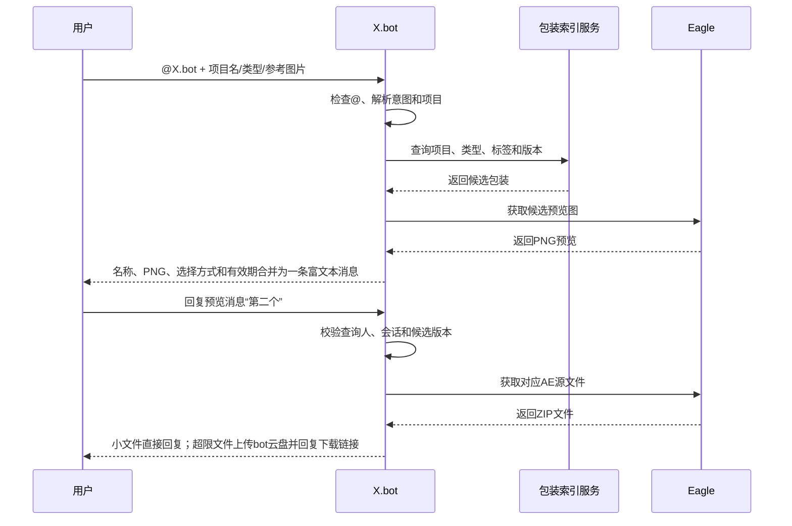

# 飞书机器人包装素材检索项目文档

## 1. 文档信息

| 项目 | 内容 |
| --- | --- |
| 项目名称 | X.bot 包装素材检索 |
| 文档版本 | v1.31 |
| 当前状态 | 飞书 `post` 富文本已接入对话与包装查询，纯图片具备安全回应边界；外部 AEP 收集、直属预合成查看/分别导出、视频框父级按图层时间取帧、逐合成 ZIP、代表帧与 Eagle 安全配对已打通；Eagle 入库插件已合并导入与正式入库流程，完成配对和项目名称管理后直接写入正式目录；多终端共享 NAS 的插件直写 Eagle、中央服务写索引边界已确定 |
| 使用平台 | 飞书、Eagle、After Effects |
| 核心目标 | 在飞书中快速查找包装预览，并在用户确认后发送对应 AE 源文件 |

## 2. 项目背景

包装素材目前主要存放在 Eagle 中，包含预览图片和对应的 AE 源文件。随着项目和包装数量增加，仅依靠人工翻找文件夹、回忆文件名或在群聊中询问，会产生以下问题：

- 同一套包装可能被多个项目重复使用，难以通过文件名快速定位。
- 人名条、标注条等元素经常混合使用，分类边界不固定。
- 部分项目会在通用包装基础上修改，容易混淆基础版和项目修改版。
- 预览图与 AE 源文件如果只靠同名文件关联，改名或移动后容易失效。
- 发送人通常只记得项目名或看到的画面，不一定知道准确素材名称。

本项目计划在现有 X.bot 中增加包装素材检索能力，让用户在飞书中通过项目名、包装类型或参考图片查找素材。机器人先返回静态预览，用户确认后再发送源文件，降低误发风险。

## 3. 项目目标

### 3.1 核心目标

1. 用户在飞书中通过 `@X.bot` 发起包装查询。
2. 机器人支持项目名、包装类型、自然语言和参考图片等输入。
3. 机器人从 Eagle 素材库中查找候选包装，并回复静态 PNG 预览图。
4. 用户通过回复消息确认候选，不使用交互卡片。
5. 机器人将对应 AE 源文件压缩包回复在最初的查询消息下面。
6. 保证预览图、包装版本、AE 工程和合成名称之间的对应关系准确。
7. 支持从 AE 项目工程中选择可复用包装合成，整理预览、工程依赖和元数据后进入 Eagle 插件的直接入库预检。

### 3.2 非目标

第一阶段不包含以下能力：

- 自动修改 AE 工程中的文字、颜色或尺寸。
- 在飞书中直接预览 AE 动画。
- 完全依赖图片识别并自动发送唯一源文件。
- 建立海外版、竖屏版、阶段版等复杂项目层级。
- 替代 Eagle 的素材整理和人工审核功能。
- 在第一阶段开发 Eagle 插件式自动入库；该能力安排在后续版本迭代。
- 在第一阶段自动判断 AE 工程中哪些合成具有复用价值；包装合成仍由制作人员明确选择。

## 4. 包装范围

包装素材主要分为以下四类：

| 类型 | 说明 | 常见标签 |
| --- | --- | --- |
| 信息条 | 包含人名条、标注条，以及两者混合使用的样式 | 人物、姓名、职位、地点、参数、说明、重点标注 |
| 视频框 | 用于承载视频、图片或局部画面的框体 | 横框、竖框、多画面、圆角、描边 |
| 背景 | 完整画面背景或包装背景层 | 主背景、过渡背景、章节背景 |
| 分镜排版 | 多画面组合、对比排版和完整镜头布局 | 双屏、三屏、对比、时间线、信息组合 |

人名条和标注条统一归入“信息条”，不强制拆成互斥类别。具体用途通过标签记录，同一个包装可以同时拥有“人物”和“标注”等多个标签。入库自动推断时，只要包装名称、文件名、目录名、标签或 manifest 类型中出现“标注”或“人名条”，默认将包装类型规范化为“信息条”；用户仍可在预检界面改成其他类型。

## 5. Eagle 素材组织

### 5.1 文件夹结构

Eagle 中建立两个顶层文件夹，并按照包装类型设置子文件夹：

```text
包装素材库
├─ 01_预览图
│  ├─ 信息条
│  ├─ 视频框
│  ├─ 背景
│  └─ 分镜排版
└─ 02_AE源文件
   ├─ 信息条
   ├─ 视频框
   ├─ 背景
   └─ 分镜排版
```

### 5.2 预览图规范

- 预览图统一使用静态 PNG。
- 信息条等需要单独辨识轮廓的叠加元素使用透明底 PNG。
- 视频框预览优先使用其上层包装展示合成，把视频框叠在背景或示例画面上显示；预览只改变展示语境，源文件仍收集用户选择的视频框合成。
- 背景和完整分镜排版使用 PNG 保存实际画面内容。
- 预览图应避免无关画面干扰，确保包装结构可以被快速辨认。
- 同一包装的不同修改版本分别生成预览图，不覆盖旧版本。

### 5.3 源文件规范

- 源文件默认使用 ZIP 压缩包发送，不直接发送裸 `.aep`。
- ZIP 应包含 AE 工程及其依赖素材，避免工程打开后丢失链接。
- 多个包装可以共用一个 AE 工程，但每条包装记录必须填写对应的 AE 合成名称。
- 源文件更新后需要同步更新版本号和索引，不允许只替换文件而不留版本记录。

### 5.4 默认命名与人工修改

```text
预览图：项目_包装类型_包装名称_版本.png
源文件：项目_包装名称_版本.zip
```

示例：

```text
阿宝_信息条_人物信息条_v02.png
阿宝_人物信息条_v02.zip
```

以上是正式入库时的默认命名。文件名用于人工识别，不作为机器人建立对应关系的唯一依据。

正式入库预检形成唯一 PNG + ZIP 配对后，插件会进入批量规范命名环节：

- 用户可以修改预览图和源文件的最终显示名称，也可以使用项目、包装类型、包装名称、版本和合成名称等字段重新生成整批名称。
- 插件在确认正式入库前校验空名称、Windows 不允许的字符、结尾空格或句点，以及同一包装类型目录中的重复名称；校验失败时不移动任何素材。
- 自定义名称只改变 Eagle 素材的名称和对应扩展名显示，不改变 `package_id`、`batch_id`、PNG/ZIP 配对 Eagle ID、事实描述或后续索引关系。原始项目工程、收集目录和 ZIP 内部文件不在该环节被改名。

### 5.5 AE 包装提取与 Eagle 入库交付规范

AE 包装提取是 Eagle 入库的上游环节，目标是把包含大量业务镜头和依赖素材的完整项目工程，整理成一个包装对应一个可审核、可直接入库的交付单元。

- 制作人员先在外部 AEP 收集工具中查看工程内全部合成、父级使用关系和内部预合成，再明确选择需要复用的包装合成，并填写或确认项目、包装名称、类型和版本；选中一个合成后可查看其直属预合成，或将直属预合成分别导出为独立收集包。
- 所有精简、依赖收集和重命名操作都在工程副本或收集副本上完成，不直接修改原始项目工程。
- 每个包装默认选择预览来源第 2 秒的帧；预览来源短于 2 秒时选择最后一个有效帧。用户可在预览窗口通过秒数输入、时间轴或前后逐帧重新生成，只有当前画面已实际渲染时才能确认。信息条等独立叠加元素的最终 PNG 必须保留透明背景。
- 视频框、横屏框和竖屏框优先选择唯一合适的直接父合成作为预览来源：父合成名称含“包装/展示/主合成/总合成”等语义，或同时引用背景类合成时优先。确定父级后，以视频框图层的 `in_point + 2 秒` 作为父级取帧时间；若超过图层或父级可见范围则取最后一个有效父级帧。存在多个同等候选或没有明确候选时不猜测，默认自身并由用户在预览窗口选择。预览来源不加入收集依赖，也不改变精简 AEP 的目标合成。
- 依赖收集默认由外部工具基于公开 `py-aep` 在内存工程中递归保留选中合成及图层素材，只向新目录保存精简 AEP 和复制后的依赖；AE 原生 `Collect Files` 保留为兼容和人工复核路径。
- 收集完成后保留 AE 生成的 Report。Report 中的合成、字体、效果和素材依赖用于入库预检，但不代替实际打开工程验证。
- 每个选中合成收集完成后自动生成一个展开目录和一个同名 ZIP。ZIP 内以收集目录名称作为唯一顶层目录，包含精简 AEP、依赖素材和 manifest；展开目录保留给 AE 打开验收，同级 ZIP 与 PNG、manifest 一起进入按项目组织的 `00_待入库` 文件夹。
- 跨合成表达式引用、缺失素材、第三方效果、字体和无法判断用途的示例素材由上游 AE 提取与打包环节检查，并写入 Report 或 manifest，不能静默忽略。
- 已经打包完成的 ZIP 进入 Eagle 后，不再逐项复核内部视频、截图、图片等依赖是否必要；Eagle 入库只读取上游结论并记录字体、第三方效果和其他明确警告。
- 自动配对失败时保留待入库状态，不根据时间戳或相似文件名直接建立正式映射。

当前试行工具采用 Windows 外部窗口，并执行以下安全分工：

- 工具直接读取 AEP 并显示全部合成，不允许因为缓存或快速素材扫描而静默返回空合成列表。
- 工具对选中合成列出的“直属预合成”仅指直接作为图层源的 `CompItem`，保持图层顺序并去重；逐个导出时每个预合成仍递归收集自己的下层预合成和素材，不把上层包装合成加入该包。
- 用户选择合成后，工具递归保留嵌套合成和图层素材，在唯一的新目录输出精简 AEP、素材目录和标准化 manifest；原工程及原素材只读。
- 输出 AEP 保存后必须重新解析，并确认目标合成仍存在；缺失素材写为“阻止入库”，重链接失败写为“警告”。
- 每个合成的 manifest 写入实际 `source_file`，随后生成同名 ZIP；工具在报告成功前检查 ZIP CRC，并确认包内包含精简 AEP 与 manifest。压缩或校验失败时删除该次收集目录和半成品 ZIP，不向 Eagle 暴露不完整产物。
- 交互调帧优先使用可选的常驻 AE 快速桥接：当 AE 已打开同一个 AEP 且 `XbotPreviewBridge.jsx` 面板运行时，通过 `saveFrameToPng` 和本地文件 IPC 快速生成当前来源合成的快照，并等待异步 PNG 完整写入。FX Console 只作为交互速度参考，不调用、不嵌入，也不依赖其私有实现。
- 快速桥接未安装、离线、当前工程不一致或超时时，交互预览自动回退本机 AE `aerender` 后台引擎。用户确认时间和来源后，收集阶段始终再执行一次高质量 `aerender` 作为最终入库 PNG。后台渲染优先使用 `Xbot PNG with Alpha` 输出模块直接写入 PNG 并验证完整尾标；模板缺失或失败时自动回退至 TIFF+Alpha 无损中转和反预乘，不直接把快速快照当最终图。
- 预览 PNG 与对应 ZIP 同名且位于同一输出目录。`xbot-collection` 写入 `preview_file`、`preview.time_seconds`、`preview.frame`、最终渲染器和 `preview.source_composition`；使用父级取景时额外写入视频框图层的 `start_time`、`in_point`、`out_point` 和实际取样偏移，明确区分收集合成与预览来源，并刷新 ZIP 内的 manifest。Eagle 优先使用显式 `preview_file` 配对，旧收集记录继续使用受控名称匹配。
- 预览生成需要本机安装且已授权 After Effects，默认超时 180 秒。授权、缺失字体或第三方插件导致预览失败时，已成功的收集目录和 ZIP 仍保留，但因缺少 PNG 不能完成 Eagle 配对。
- 逐合成收集记录使用 `manifest_type: xbot-collection`，记录合成、ZIP、依赖和收集自检事实；补齐 PNG、包装类型、版本和稳定 ID 后的正式入库清单使用 `manifest_type: xbot-eagle-ingest`。两者不能互相冒充。
- 跨合成表达式、字体、第三方效果和最终画面仍需在 AE 中打开收集工程复核；离线收集不等于离线渲染。
- 旧 ScriptUI 面板已验证的代表帧 PNG、风险扫描和 ZIP 能力可拆分复用，但不再作为收集主入口。

建议的待入库结构：

```text
00_待入库
└─ 变速箱
   ├─ manifest.json
   ├─ 变速箱_信息条_小标注_v01.png
   ├─ 变速箱_小标注_v01.zip
   ├─ 变速箱_背景_黑色纹理背景_v01.png
   ├─ 变速箱_黑色纹理背景_v01.zip
   ├─ 变速箱_视频框_横向单画面框_v01.png
   └─ 变速箱_横向单画面框_v01.zip
```

正式入库 manifest 至少为每条包装记录包含以下内容：

| 字段 | 说明 |
| --- | --- |
| `manifest_version` | manifest 结构版本 |
| `package_id` | 本次提取生成或沿用的包装唯一 ID |
| `source_project_name` | 原 AE 项目名称，用于追溯，不作为检索主键 |
| `project_name` | 对外检索使用的项目名称 |
| `package_name` | 包装名称 |
| `package_type` | 信息条、视频框、背景或分镜排版 |
| `version` | 包装版本 |
| `ae_comp_name` | 用户选择的 AE 合成名称 |
| `preview_time` | 预览图对应的合成时间点 |
| `preview_file` | 待入库 PNG 文件名 |
| `source_file` | 待入库 ZIP 文件名 |
| `fonts` | Report 检出的字体依赖 |
| `effects` | Report 检出的效果和第三方插件依赖 |
| `dependency_status` | 完整、警告或阻止入库 |
| `created_at` | 提取时间 |

### 5.6 本地项目文件夹批次导入规则

Eagle 入库助手支持把一个本地项目包装文件夹作为一个完整批次导入。该功能保留“这批素材来自同一个项目文件夹”的上下文，但不把源目录的全部层级和文件原样镜像进 Eagle。

标准流程：

1. 用户将本地项目包装文件夹拖入插件窗口，或通过文件夹选择器指定目录。
2. 插件解析文件夹名称、父级项目路径和 manifest，展示识别到的项目名称；用户确认后才创建批次。
3. 插件递归扫描源目录。存在 `xbot-eagle-ingest` 正式入库 manifest 时，只把其明确引用的 PNG 和 ZIP 列为入库候选；只有 `xbot-collection` 收集记录时，读取合成、ZIP 和依赖事实后按唯一规则与根目录 PNG 配对；两种 manifest 都不存在时按受控文件名规则识别候选。
4. 插件在同一界面展示项目、类型、版本、AE 合成、PNG/ZIP 配对、重复映射和 Report 警告等预检结果；用户可以修改项目名称、包装名称，或在受控候选范围内分别更换 PNG、ZIP。
5. 人工修改后重新执行唯一配对、缺失文件、重复引用和命名校验。确认通过后，插件直接调用 Eagle 官方 API，将 PNG 写入 `01_预览图/<类型>`、ZIP 写入 `02_AE源文件/<类型>`，并写入稳定注释、标签和配对 Eagle ID。
6. 入库成功后，插件追加批次事件供 bot 写入索引；源文件夹保持不变。新流程不创建 `00_待入库` 中间批次文件夹；历史遗留的 `00_待入库` 批次仍可从“历史待入库”入口独立处理。

插件现在把“选择文件夹、扫描配对、项目/包装名称确认、直接写入正式目录”合并为一个操作。重复导入仍必须显式选择复用、更新或新建独立批次；复用和更新按稳定 `package_id` 处理，新建模式生成独立 `batch_id`。新导入完成后不再需要切换到第二个“正式入库”页面。

为兼容升级前数据，用户也可以使用 Eagle 自带文件夹导入把项目放到 `00_待入库`，再从“历史待入库”入口处理。该兼容路径仍以 Eagle 当前待入库目录中的真实文件为准，独立完成递归读取、候选筛选、PNG/ZIP 配对、字段推断、人工补充和正式归位，不能依赖插件导入阶段预先写入的注释。

没有 manifest 时的默认扫描规则：

- 源文件夹根目录中的 PNG 可作为预览候选。
- 源文件夹根目录或 `Root_Collected_Projects` 根目录中的 ZIP 可作为源文件候选。
- 展开的收集工程目录、`.aep`、Report、字体文件、业务视频、JPG、依赖 PNG 和示例截图只用于检查或显示警告，不作为独立 Eagle 素材导入。
- 对已经打包完成的 ZIP，只校验文件存在、可读取、扩展名正确并能与唯一 PNG 配对，不解包判断内部依赖素材是否必要。
- 文件名、创建时间和目录位置只能辅助配对，无法唯一确认时标记为冲突，不能自动建立正式映射。
- 用户可以在预检界面手工改正候选类型，但不能绕过缺失预览、缺失 ZIP 或重复映射检查。
- 自动配对结果以 PNG + ZIP 成对卡片展示；用户可以直接修改包装名称，或在受控候选范围内分别更换预览图和打包文件。应用人工覆盖后必须重新执行唯一配对、缺失文件和重复引用校验；深层依赖文件不因人工操作被提升为入库候选。

收集记录配对规则：

- `xbot-collection` 不触发全局文件白名单，也不因缺少 `package_id` 或 `preview_file` 报正式清单字段错误。
- 插件先匹配规范化后唯一相同的合成名和 PNG 名，再处理受控别名；已经被更精确合成占用的 PNG 不参与后续匹配。
- “角括号/尖括号”“横屏框/横屏视频框”“竖屏框/竖屏视频框”等已确认别名可以规范化；仍有多个可能预览时保持冲突并要求人工处理。
- 收集记录、展开 AEP 和依赖素材只用于校验，最终仍只把唯一配对的根目录 PNG 和逐合成 ZIP 导入 Eagle。

预检界面将扫描结果分为四种状态：

| 状态 | 含义 | 示例 |
| --- | --- | --- |
| 将导入 | 符合规则并已唯一配对 | 包装预览 PNG、包含依赖的 ZIP |
| 仅校验 | 用于判断完整性但不单独入库 | AE Report、展开工程中的 `.aep` |
| 忽略 | 与包装入库无关或已包含在 ZIP 中 | 业务视频、示例截图、依赖图片 |
| 冲突 | 无法自动确认，必须人工处理 | 多张预览对应同一 ZIP、同名不同版本 |

历史批次的待入库结构示例（新流程不再创建）：

```text
00_待入库
└─ 变速箱包装
   ├─ 变速箱_信息条_小标注_v01.png
   ├─ 变速箱_小标注_v01.zip
   ├─ 变速箱_背景_黑色纹理背景_v01.png
   ├─ 变速箱_黑色纹理背景_v01.zip
   ├─ 变速箱_视频框_横向单画面框_v01.png
   └─ 变速箱_横向单画面框_v01.zip
```

同一路径或相同 `batch_id` 再次导入时，插件必须展示“复用现有批次、更新现有批次、新建独立批次”三个选择，默认不创建重复素材。批次关系和处理结果写入 SQLite；不能依赖 Eagle 文件夹名称作为唯一标识。

### 5.7 正式入库与素材描述规则

正式入库由导入界面的“直接入库 Eagle”按钮执行。处理顺序如下：

1. 扫描用户选中的本地项目文件夹及其子目录。优先使用 manifest；没有 manifest 时，从项目文件夹名称、受控位置中的 PNG/ZIP、文件名、类型目录和 AE Report 提取项目、包装名称、类型、版本和 AE 合成。
2. 每条包装必须形成唯一的“一张 PNG + 一个 ZIP”配对。文件名和目录名只能辅助识别；无法唯一配对时保留冲突状态。“标注”和“人名条”直接规范化为“信息条”；其他缺少包装类型但 PNG/ZIP 已唯一配对的记录，在预检界面提供四类包装的人工选择，不要求用户重新走插件导入流程。
   自动配对只是默认建议；用户可以在导入预检卡片中直接修改包装名称，或从受控候选文件中更换 PNG/ZIP。修改后仍必须形成唯一配对，不能通过手动选择绕过缺失、重复或深层依赖文件检查。
3. 缺少版本时必须由用户确认后再登记；首次版本可以在确认后统一使用 `v01`，不得静默猜测。
4. 预览图默认按 `项目_包装类型_包装名称_版本` 命名并进入 `01_预览图/类型`；源文件默认按 `项目_包装名称_版本` 命名并进入 `02_AE源文件/类型`。用户可在导入预检卡片中修改项目/包装名称，也可在历史待入库兼容路径的批量命名环节逐条覆盖名称，确认后才执行写入。
5. PNG 与 ZIP 使用相同的项目、类型、版本和依赖状态标签；用途或视觉标签只有在来源明确时才添加。
6. 使用稳定的 `package_id` 和 `batch_id`，并在 PNG 与 ZIP 中互相记录配对 Eagle ID。单机兼容模式由 bot 把批次和明细写入本地 SQLite；多终端共享模式由插件把事件提交给中央索引服务，由服务端单点写入正式映射；重复事件按 `event_id` 幂等，失败事件允许重试。
7. 新流程直接写入正式目录，不产生待入库批次文件夹。历史兼容路径正式入库后，素材从待入库批次文件夹移出；随后递归检查批次文件夹及所有子目录，只有确认全空时才允许清理。
8. 删除文件夹只能使用 Eagle 官方支持的 API；如果当前 Web API 或 Plugin API 没有删除能力，则保留空目录并提示用户在 Eagle 界面手动删除，不得直接修改 `.library` 内部元数据。

直接扫描本地文件夹时，默认把根目录中的 PNG/ZIP、`Root_Collected_Projects` 第一层的 ZIP，以及四类包装类型子目录第一层的 PNG/ZIP 作为候选；更深层的 PNG、ZIP、视频、截图、展开工程和依赖素材只用于校验，不参与正式配对。插件通过 Eagle Plugin API 为最终配对写入统一 `package_id`、`batch_id`、类型、版本、配对 ID、标签和事实描述，并按正式命名规则直接整理到正式目录。

### 5.8 标签组组织

Eagle 标签管理中单独建立“项目”分组，用于集中浏览和筛选项目名标签。当前项目标签包括“支付宝阿宝”“华为途灵”“乾崑奕境”“变速箱”；它们仍保留在素材标签上，不与包装类型、信息用途、画面结构或背景用途标签混为一组。插件在直接正式入库前，以及处理历史待入库批次时，通过 Eagle 官方标签组 API 确保“项目”分组存在，并把当前项目标签增量加入其中，避免新项目标签散落在未分类区域；不会覆盖既有标签，也不直接修改 `.library` 内部文件。

正式素材描述只记录以下事实字段：

- 项目、原 AE 项目、`package_id`、包装名称、包装类型和版本。
- AE 合成、`batch_id`、配对预览图或源文件 Eagle ID、当前状态。
- Report 明确列出的字体和第三方效果；存在依赖风险时同时添加“依赖警告”标签。

以下内容不写入素材描述：

- 用户确认、审核人确认或本次操作是否已获批准。
- “本环节不判断 ZIP 内依赖是否必要”等流程边界说明。
- API 调用结果、操作时间、临时预检结论或其他一次性操作历史。

ZIP 内依赖必要性的判断属于上游 AE 提取与打包职责。Eagle 入库只验证 ZIP 文件本身可读取且与包装记录唯一配对，因此不需要把该流程说明重复写入每个 ZIP 的描述。

### 5.8 多终端共享 NAS Eagle 资源库

项目后续面向多个用户共同使用的场景如下：Eagle 资源库部署在公用 NAS 上，每个用户在自己的终端安装集成插件，并使用本机的 Eagle 和 After Effects。用户在本机选择 AE 工程和包装合成，工具在本机生成待入库文件，然后通过插件直接写入当前 Eagle 打开的共享资源库。

该场景必须区分素材写入和索引写入：

| 写入对象 | 负责方 | 规则 |
| --- | --- | --- |
| PNG、ZIP、Eagle 文件夹、标签和描述 | 用户终端上的 Eagle 集成插件 | 通过 Eagle 官方 Plugin API 写入当前共享 Library，不直接修改 `.library` 内部文件 |
| 项目、包装、版本、配对 Eagle ID、源路径、批次和审计状态 | 中央索引服务 | 插件通过局域网 HTTP API 提交幂等入库事件，由服务端单点写入数据库 |
| 查询、候选排序和发送状态 | X.bot / 中央索引服务 | bot 通过索引服务读取统一数据，不依赖某个用户终端的本地数据库 |

目标入库流程：

```text
本地 AE 工程
    ↓
集成插件内置的 AEP Worker
    ↓ 本地暂存 PNG + ZIP + manifest
Eagle 集成插件
    ↓ Eagle 官方 Plugin API
NAS 共享 Eagle Library
    ↓ 素材导入成功后提交 event_id / batch_id / package_id
中央索引服务
    ↓ 单点写入
中央数据库
    ↓
X.bot 查询、候选确认和源文件发送
```

约束如下：

- 插件必须直接完成 Eagle 素材导入，不能只把事件交给某台用户电脑上的本地 bot。
- 插件不得让多个终端通过 SMB/NAS 直接打开同一个 SQLite 文件；SQLite 如果继续使用，只能作为中央索引服务进程访问的服务端数据库。
- 插件可以在 `%LOCALAPPDATA%\\XbotPackaging\\outbox` 保留待重试事件；该 outbox 只用于中央 API 暂时不可用时的可靠重试，不是多用户共享主数据库。
- 只有在 Eagle 官方 API 成功导入或更新素材后，插件才提交“素材写入成功”的索引事件。
- 中央服务应提供健康检查、配置化的局域网地址、服务端日志和定期对 Eagle 共享库的只读对账能力。
- 具体 Eagle 版本、NAS 协议和并发写入行为必须通过项目验收测试确认；若实测不能保证并发写入安全，应增加中央导入协调或串行写入闸门。

当前 M1 的本地 SQLite 和指定库目录只读同步继续保留为单机兼容模式，不能作为未来多终端共享部署的正式数据同步方案。

## 6. 包装数据模型

Eagle 负责素材保存和日常管理，索引服务保存项目、包装、版本、预览、源文件和入库事件之间的稳定映射。当前 M1 使用本地 SQLite 作为单机兼容实现；面向多个终端的共享部署由中央索引服务统一读写，终端不直接访问服务端数据库文件。

### 6.1 核心字段

| 字段 | 说明 |
| --- | --- |
| `package_id` | 包装唯一 ID |
| `project_id` | 所属项目 ID |
| `project_name` | 项目名称 |
| `project_aliases` | 项目简称和常用别名 |
| `package_name` | 包装名称 |
| `package_type` | 信息条、视频框、背景或分镜排版 |
| `tags` | 用途、视觉特征和近义词标签 |
| `version` | 当前版本号 |
| `base_package_id` | 基础包装 ID，原创版本可为空 |
| `preview_eagle_id` | Eagle 中的预览图 ID |
| `source_eagle_id` | Eagle 中的源文件 ID |
| `source_path` | 可验证的源文件路径或插件返回路径 |
| `ae_comp_name` | 对应 AE 合成名称 |
| `status` | 启用、停用或归档 |
| `updated_at` | 最近更新时间 |

### 6.2 多项目复用

同一包装可以关联多个项目。项目和包装之间采用多对多关系，不为每个项目重复保存一份相同源文件。

项目修改版需要建立新的包装版本，并通过 `base_package_id` 指向原包装。例如：

```text
通用人物信息条 v01
└─ 阿宝项目人物信息条 v02
   └─ 阿宝项目人物信息条 v03
```

检索项目包装时优先返回该项目的修改版；没有修改版时再返回关联的通用版本。

### 6.3 中央索引服务

中央索引服务是多终端部署的唯一数据库写入方，至少提供以下接口能力：

- `POST /ingest-events`：接收插件提交的批次和包装入库事件，按 `event_id`、`batch_id` 和 `package_id` 幂等处理。
- `GET /packages`：按项目、别名、包装类型、标签和版本查询候选。
- `GET /packages/{package_id}`：读取 PNG/ZIP 的 Eagle ID、配对关系、AE 合成和依赖事实。
- `GET /health`：返回服务、数据库和 Eagle 共享库访问状态。
- 对账任务：根据共享 Eagle Library 的官方 API 或只读库扫描结果，发现事件丢失、素材移动和索引不一致。

服务端数据库可以先继续使用 SQLite，但只能由中央服务进程访问；如果并发量、审计要求或部署规模增加，再迁移到 PostgreSQL 等服务型数据库，插件接口保持不变。

## 7. 查询与触发规则

### 7.1 触发条件

所有新的包装查询都必须明确 `@X.bot`，包括私聊和群聊。未 `@X.bot` 的新消息不触发包装检索。

飞书 compact 事件中的 `text` 和带文字的 `post` 都可以承载查询；`post` 的 `@`、可见文字与图片占位先规范化，再进入同一套触发和确认规则。纯图片本身不启动包装查询：私聊会收到“尚未识图”的明确回应；群聊仅在图片消息回复 X.bot，或事件带有效 `@X.bot` 时回应。当前不会下载图片或发送外部视觉模型。

触发采用“规则快路径 + AI 语义兜底”两层：

1. 规则快路径：内容命中项目名（或别名），且带包装动作词（找、查、搜索、要、需要、想要、有没有、发一下、看看、帮忙等）或领域词（信息条、标注、视频框、背景、分镜、素材、模板等）其一即可触发。
2. AI 语义兜底：规则未命中但消息已 `@X.bot` 时，调用大模型判断是否为包装查询并提取项目与类型，再走同一套候选流程；AI 不可用、超时或判断失败时自动回退原规则，不拦截普通聊天。

如果消息已经明确是在调取包装，但项目名或别名没有命中当前 Eagle 索引，机器人会先回复当前可查的项目名和一条查询示例，不创建候选确认记录，也不发送预览或源文件。项目列表只展示当前存在可用包装的正式项目名，不把别名重复混入列表。

示例：

```text
@X.bot 查阿宝项目的包装
@X.bot 找阿宝项目的信息条
@X.bot 我要变速箱的背景
@X.bot 变速箱小标注
@X.bot 找这张图片里的包装
图片 + “@X.bot 阿宝项目”
```

查询进入确认阶段后，原查询人回复候选消息时不需要再次 `@X.bot`。

新查询与候选确认按以下优先级分流：

1. 消息明确 `@X.bot`，并命中已知项目名（或别名）及包装动作词/领域词时，必须作为新的包装查询处理；即使当前会话存在历史待确认记录，也不得先回退到旧查询。
2. 回复候选或提示消息时，优先使用飞书 `reply_to` 精确定位对应查询，再解析“这个、第二个、确认、不是”等确认或拒绝语义。
3. 没有回复引用时，不读取任何历史 `pending` 查询，不继承项目，也不处理确认、拒绝、数字选择或类型语境延续；消息继续按新查询或普通聊天路由。
4. 通过回复引用定位的候选超过有效期时，只使该候选确认失效，不能截断同一条消息中可独立成立的新查询。

普通闲聊不会被误触发：只有项目名而没有包装意图（如“@X.bot 变速箱坏了怎么修”）、或只有领域词而没有项目名与动作词（如“背景资料整理好了”）时不进入包装流程。

### 7.2 模糊输入

机器人需要容忍以下输入变化：

- 项目简称、历史名称和常用别名。
- 少量错别字或缺字。
- “人名条、人物条、姓名条”等近义表达。
- “阿宝那个标注”“找一下阿宝的框”等自然语言。
- “第一个、第一张、1、就这个”等确认表达。

模糊匹配只能用于召回候选，不能绕过用户确认直接发送源文件。

规则未命中时，大模型语义兜底可补足更自然的表达（如“我想要那种氛围感的东西”）；识别出的项目和类型仍受同一套候选排序和确认约束。

## 8. 检索策略

候选包装按照以下优先级排序：

1. 项目名称精确匹配。
2. 项目别名和项目名称模糊匹配。
3. 项目关联包装中的类型和标签匹配。
4. 参考图片与候选预览图的相似度。
5. 历史使用记录、常用程度和更新时间。

当用户提供“图片 + 项目名”时，只在该项目关联的包装范围内进行图片识别。没有项目名时，图片识别作为辅助召回方式，机器人应返回多个候选，不直接判断唯一答案。

图片识别不依赖 Eagle 内置 AI 搜索作为第一版核心能力。Eagle 负责素材存储和普通查询，视觉相似度由独立的本地或外部识别模块提供。

除图片识别外，第一阶段的文字查询本身也支持大模型语义判断兜底：当关键词规则无法命中时，由大模型判定“是否在找包装素材”并提取项目名、包装类型，判定结果继续进入现有排序与候选流程，不能绕过确认直接发送源文件。

## 9. 消息流程

### 9.0 接收消息类型

- `text`：沿用现有对话、包装查询、语音和文档路由。
- `post`：保留可见文字和 `@`，把内嵌图片转为 `[图片]` 占位后进入与 `text` 相同的路由；富文本回复候选消息时仍按 `reply_to` 精确确认。
- `image`：不把图片二进制交给当前文字模型。私聊直接回应；群聊仅在有效提及或回复 X.bot 时回应，提示当前尚未接入视觉识别并请用户补充文字。
- 其他非文本消息继续使用类型提示，不进入包装查询或候选确认。

### 9.1 标准流程



### 9.2 候选回复示例

```text
单候选和多候选统一使用一条富文本消息；每个候选名称紧跟对应图片，操作提示和有效期放在同一条消息末尾：

找到 2 个候选：

1. 阿宝 · 人物信息条（v02）
2. 阿宝 · 通用标注条（v01）

预览按上面的顺序发了，请直接回复这条消息，用数字（比如“第二个”）选一个。
20 分钟内有效，只有你能确认。
```

单候选同样使用一条富文本消息，包含候选名称、PNG、“回复这个”的操作说明和有效期。

### 9.3 用户确认

支持以下确认表达：

```text
确认
就是这个
发源文件
第一个
第二张
2
```

支持以下继续检索表达：

```text
不是
换一个
都不对
找信息条
再看看背景
```

为了避免把群聊普通对话误判为确认，用户应回复机器人发出的候选预览消息。机器人只接受原查询人的确认。

确认阶段的语境继承规则：

- 确认、拒绝和类型追问都必须回复机器人发出的候选富文本消息，并按回复引用精确定位对应查询。
- 显式 `@X.bot + 已知项目名/别名 + 包装意图` 始终视为新查询；例如 `@X.bot 给我变速箱的背景` 必须直接创建“变速箱 / 背景”查询。
- 没有回复引用时不读取任何历史查询、不继承项目，也不处理候选确认；消息继续按新查询或普通聊天路由。
- 多条查询可以并存：回复任一候选富文本消息都能确认对应查询，语境延续（如“看看背景”）会创建新查询但**不取消旧查询**；只有 20 分钟过期或用户明确拒绝（“不是/都不对”）才使查询失效。
- 多候选合并消息无法精确定位是哪张图，因此“这个”会提示明确数字；数字选择（“第二个”“2”）按图片编号一一对应。

### 9.4 源文件回复

- 用户确认后，机器人先回复简短确认结果。
- AE 源文件 ZIP 必须回复在最初的查询消息下面。
- 预览消息、确认消息和源文件通过原查询消息 ID 建立关联。
- 源文件发送幂等按单个候选记录（`request_id + package_id`）：同一查询内不同候选可分别发送，重复确认同一候选不重复上传。
- 超过机器人单文件上限（约 30MB）的源文件，自动上传到 bot 飞书云盘并回复下载链接；小文件仍直接发送。

## 10. 查询状态管理

每次查询至少保存以下状态：

| 字段 | 说明 |
| --- | --- |
| `request_id` | 查询唯一 ID |
| `requester_id` | 原查询人 |
| `chat_id` | 所在会话 |
| `root_message_id` | 最初查询消息 ID |
| `preview_message_ids` | 候选预览消息 ID |
| `candidate_package_ids` | 当前候选及排序 |
| `selected_package_id` | 已选择的包装版本 |
| `status` | 查询中、待确认、发送中、已完成或已过期 |
| `expires_at` | 查询过期时间 |

建议待确认状态保留 20 分钟。超时后用户需要重新 `@X.bot` 发起查询。

多条查询可并存，各自独立保留 20 分钟；新查询和语境延续都不取消旧查询，避免用户已看到的预览突然失效。源文件发送状态按候选记录在交付表中，查询级状态只表达生命周期（准备中、待确认、已取消、已过期、失败）。

## 11. 技术架构

```text
入库链路：
AE 原始项目
    ↓ 人工选择包装合成
AE 包装提取辅助工具
    ↓ PNG + ZIP + manifest + 依赖报告
Eagle 入库助手：配对、命名与确认
    ↓ 通过官方 Plugin API 直接写入
Eagle 素材 + SQLite 稳定映射

检索链路：
飞书消息事件 → @X.bot 触发判断 → 查询意图与可选视觉识别
    → 包装索引服务 → Eagle 素材
    → 预览候选 → 原查询人确认 → ZIP 回复原消息
```

### 11.1 AE 侧

AE 包装提取辅助工具负责：

- 不启动 AE 即读取全部合成和嵌套关系，并接收制作人员明确选择的包装合成。
- 选中合成后列出直属预合成，并支持将每个直属预合成分别收集、渲染代表帧和打包 ZIP。
- 按选中合成递归复制并重链接依赖，在新目录保存精简 AEP 和 manifest，保存后执行再次解析自检，并为每个合成生成一个经过完整性校验的同名 ZIP。
- 在需要画面预览时调用 AE 侧能力读取指定预览时间点；离线解析器不伪装成渲染器。
- 对视频框类合成，把唯一合适的上层包装展示合成作为默认预览来源，并按父级内视频框图层出现后的第 2 秒取帧，允许用户切换；来源选择只影响 PNG 取景，不改变收集合成和 ZIP 依赖边界。
- AE 已打开同一工程时通过可选常驻桥接快速调帧；AE 未打开时由高质量后台渲染优先直接生成 PNG，失败自动回退 TIFF 中转。
- 生成规范化 PNG 预览，并保留透明通道要求。
- 引导或执行基于选中合成的依赖收集，在副本上精简工程并生成 ZIP。
- 读取 AE 收集报告中的合成、字体、效果和素材依赖。
- 生成标准化 manifest，并将风险标记为完整、警告或阻止入库。
- 保证任何自动处理都不覆盖原始 `.aep` 和原始项目素材。

AE 辅助工具不负责判断某个合成是否具有业务复用价值，也不负责把素材直接写入 Eagle 正式目录。

### 11.2 飞书侧

飞书负责：

- 接收文字、富文本和图片消息事件。
- 获取 `@X.bot`、发送人和消息上下文。
- 当前只消费富文本的可见文字和图片占位；纯图片先做安全回应，不下载、不外发，后续视觉识别阶段才在用户明确许可后下载参考图片。
- 在指定消息下回复 PNG 和 ZIP 文件。
- 接收用户对候选预览的文字回复。

### 11.3 Eagle 侧

Eagle 负责：

- 保存和管理预览 PNG、AE 源文件 ZIP。
- 提供文件夹、标签和素材的普通查询。
- 提供预览图及源文件定位能力。
- 审核 AE 辅助工具生成的 manifest、配对结果和依赖状态。
- 在多终端共享模式下，由集成插件直接调用 Eagle 官方 Plugin API，将本地暂存的 PNG、ZIP、文件夹、标签和描述写入当前打开的 NAS 共享 Library。
- 插件不直接编辑 `.library` 内部的 `metadata.json`，也不把共享 Library 当作 SQLite 或普通文件复制目标处理。

Eagle Web API 普通素材列表不应被假定始终包含稳定的原始文件路径。源文件路径可通过本地索引保存，或通过一个小型 Eagle 后台插件读取官方 Plugin API 的 `filePath`。

### 11.4 机器人服务

机器人服务负责：

- 触发规则和意图识别：规则快路径 + 大模型语义兜底双层判断。
- 项目、包装、版本和文件映射。
- 模糊搜索和候选排序。
- 图片相似度模块的调用。
- 查询状态、候选级幂等、权限和重复发送控制。
- 多候选合并预览、语境延续与多条查询并存管理。
- 索引读取：多终端共享模式通过中央索引服务查询；单机兼容模式可只读解析指定 Eagle 库目录（不依赖 Eagle 当前活动库），也可走 Eagle Web API。
- 入库事件接收：中央索引服务接收插件在 Eagle API 操作成功后的幂等事件，并负责单点写入数据库。
- 共享库对账：定期发现素材已写入但事件未到达、素材移动或客户端离线造成的索引差异。
- 超限源文件的云盘上传与链接回复降级。
- 运行日志、错误提示和健康检查。

## 12. 异常与边界处理

| 情况 | 处理方式 |
| --- | --- |
| 没有 `@X.bot` | 不触发新的包装查询 |
| 群聊中的普通 `post` 或纯图片没有有效提及/回复关系 | 保持静默，不对群内所有富媒体消息自动插话 |
| `post` 含可见文字并有效提及 X.bot | 规范化文字、`@` 和图片占位后进入现有对话与包装查询路由 |
| 纯图片满足私聊或群聊回复条件 | 明确确认收到并说明尚未接入视觉识别，不推断图片内容、不发送外部 AI |
| 未识别项目名 | 列出当前 Eagle 索引中可查的项目名，并给出查询示例；索引没有可用项目时提示暂时无法读取项目列表 |
| 没有候选 | 提示未找到，并给出识别到的项目和类型 |
| 候选过多 | 优先按项目和类型缩小范围，首轮最多返回 3 个 |
| 图片中有多个包装 | 按类型分组返回候选，并要求用户说明要找哪一个 |
| 其他人回复“确认” | 不发送源文件，提示由原查询人确认 |
| 查询已过期 | 提示重新 `@X.bot` 发起查询 |
| 确认消息无回复引用 | 不读取历史查询，不发送源文件；提示用户回复候选消息（如需提示） |
| 明确的新查询与历史待确认记录同时存在 | 优先新建查询；不得将项目名明确的新查询绑定到旧候选，旧候选是否过期不影响新查询 |
| 回复已被取消或过期的旧预览 | 提示查询失效，引导重新 `@X.bot` 查询 |
| Eagle 未运行 | 提示素材库暂时不可用，并记录错误 |
| 预览存在但源文件缺失 | 不进入可确认状态，提示素材映射异常 |
| 视频框存在多个上层展示合成 | 不自动猜测；默认自身并要求用户在预览窗口明确选择来源 |
| 快速预览桥接未运行或 AE 工程不一致 | 自动回退 `aerender`；不切换或覆盖 AE 当前工程 |
| AE 合成存在跨合成表达式引用 | 禁止无提示精简，要求人工检查收集副本 |
| Report 检出缺失字体或第三方效果 | 标记依赖警告，审核人确认后才能启用 |
| 已打包 ZIP 内含视频、截图或图片依赖 | Eagle 入库不判断其必要性；只校验 ZIP 可读取并与唯一包装记录配对，依赖取舍由上游 AE 提取与打包环节负责 |
| manifest 与 PNG/ZIP 无法唯一配对 | 阻止正式入库，不使用时间戳猜测映射 |
| 文件夹中包含展开工程和依赖素材 | 仅将其用于校验，不原样递归导入 Eagle |
| 同一项目文件夹重复导入 | 根据 `batch_id` 和文件签名提示复用、更新或新建，不静默复制 |
| 正式入库后留下空批次文件夹 | 递归确认整棵目录无素材且子目录均为空后允许清理；官方 API 不支持删除时由用户在 Eagle 界面手动删除 |
| ZIP 上传失败 | 保留查询状态，允许原查询人重试 |
| 重复确认 | 返回已发送状态，不重复上传 |
| 源文件超过机器人单文件上限 | 自动上传 bot 云盘并回复下载链接 |
| 多条查询并存时确认 | 必须回复具体候选或提示消息，通过引用精确定位，不接受无引用确认 |

## 13. 权限与安全

- 机器人只能发送已启用且映射完整的源文件。
- 源文件在群聊中回复后，群内成员可能均可查看，因此需要继承当前项目的群聊访问边界。
- 如后续出现敏感项目，可为项目增加允许群聊或允许用户列表。
- 日志不记录飞书密钥、Eagle API Token 或源文件完整内容。
- 图片识别如果调用外部 AI 服务，需要单独确认图片是否允许上传到外部服务。
- AE 提取工具只对本地工程副本执行写操作，不上传工程、预览或依赖素材到外部服务。

## 14. 素材入库检查

新增或更新包装时，应完成以下检查：

- [ ] 包装合成由制作人员明确选择，原始 AE 工程未被精简或覆盖。
- [ ] 上游 AE 提取与打包环节已完成依赖收集和必要性判断。
- [ ] 已放入正确的 Eagle 文件夹。
- [ ] 已生成对应静态 PNG 预览。
- [ ] 透明叠加元素保持透明背景。
- [ ] 已准备包含依赖素材的 AE 源文件 ZIP。
- [ ] ZIP 文件可读取，并能与唯一 PNG、包装名称和版本配对；Eagle 入库不逐项复核 ZIP 内依赖是否必要。
- [ ] 已生成 manifest 并能唯一配对 PNG、ZIP 和 AE 合成；没有 manifest 时，已按受控位置、Report 和用户确认补齐等价字段。
- [ ] 已检查 Report 中的字体、效果、第三方插件和缺失素材。
- [ ] 已填写项目、包装类型、标签和版本。
- [ ] 修改版已关联基础包装。
- [ ] 已填写 AE 合成名称。
- [ ] 素材描述只包含稳定元数据、配对关系和依赖事实，不包含审核确认或 ZIP 校验流程说明。
- [ ] 预览图和源文件均能被机器人读取。
- [ ] 在测试群完成一次查询、确认和源文件发送。

## 15. 实施阶段

### 第一阶段：文字检索闭环

- 建立 Eagle 文件夹和 SQLite 索引。
- 实现 `@X.bot` 包装查询触发。
- 支持项目名、项目别名、包装类型和标签检索。
- 规则未命中时由大模型语义判断补足自然语言表达。
- 回复单条候选富文本消息，把静态 PNG、候选名称、选择方式和有效期放在一起。
- 通过用户文字回复确认：必须使用回复引用精确定位，同时支持回复内的语境延续和多条查询并存。
- 将 ZIP 回复在原查询消息下面。
- 超过机器人单文件上限的源文件自动上传 bot 云盘并回复下载链接。
- 索引同步可只读解析指定 Eagle 库目录，不依赖 Eagle 当前活动库。

### 第二阶段：版本与模糊输入

- 支持通用包装、多项目复用和项目修改版。
- 完善错别字、别名和近义词匹配。
- 增加入库校验、查询过期、权限和幂等处理。

### 第三阶段：图片识别

- 下载飞书参考图片。
- 识别画面中的包装区域和包装类型。
- 在指定项目候选中进行相似度排序。
- 没有项目名时返回多个候选，不自动发送源文件。

### 第四阶段：运行保障

- 配置机器人和 Eagle 依赖的启动检查。
- 增加断线重连、失败重试和健康状态日志。
- 根据真实使用记录优化候选排序和近义词表。

### 第五阶段：Eagle 内 AEP 收集与入库工具链

- 在 Eagle 插件内提供 AEP 收集工作台，由随插件分发的 Windows `XbotAepWorker.exe` 不启动 AE 主界面即显示全部合成、父级使用关系和内部预合成；视频框默认按父级图层出现后的第 2 秒取预览帧。原 `XbotAepCollector.exe` 保留为兼容和离线验收入口。
- 支持对选中合成一键列出直属预合成，并将直属预合成逐个输出为独立收集包；每个包继续递归保留自身下层依赖。
- 按用户选择的合成在新目录收集依赖、精简工程并输出 AEP、素材目录和 manifest；每个合成自动生成独立 ZIP 和代表帧 PNG，默认第 2 秒且可在预览窗口调帧，Report 保持可选。
- 检查跨合成表达式、缺失素材、字体、第三方效果和明显无关的示例素材。
- 开发 Eagle 窗口插件，支持在插件内选择 AEP、勾选独立交付合成并生成收集产物，也支持拖入或选择整个本地项目包装文件夹直接进入正式入库预检。
- 完成配对、项目/包装名称管理和校验后，直接将 PNG/ZIP 写入 `01_预览图` 与 `02_AE源文件`；保留历史 `00_待入库` 批次的兼容处理入口。
- 递归扫描但不原样镜像目录；优先按 manifest 导入，否则只识别受控位置中的 PNG 和 ZIP。
- 区分 `xbot-collection` 和 `xbot-eagle-ingest`：收集记录参与合成/ZIP/依赖校验与安全配对，正式清单才是文件白名单。
- 在确认前展示“将导入、仅校验、忽略、冲突”四类结果，并通过 `batch_id` 防止重复导入。
- 自动识别 PNG 预览图、AE 源文件 ZIP 和 manifest，并按 `package_id`、项目、包装名称和版本进行配对。
- 对已打包 ZIP 只检查存在性、可读取性和唯一配对，不在 Eagle 插件中重复判断内部依赖素材是否必要。
- 在插件界面展示配对清单、缺失字段、配对冲突和异常文件。
- 支持人工补充包装类型、标签、版本、AE 合成名称和基础包装关系。
- 用户确认后，将 PNG 和 ZIP 分类到正式目录并添加对应标签。
- 按统一字段写入正式素材描述，不写入用户确认、审核过程或 ZIP 校验边界等一次性说明。
- 单机兼容模式将预览图 Eagle ID、源文件 Eagle ID、项目、版本和合成名称写入本地 SQLite；多终端共享模式由插件在 Eagle API 成功后向中央索引服务提交幂等事件。
- 将 AEP Worker 随 Eagle 集成插件一起分发，普通用户只需具备 Eagle 和 After Effects，不要求额外安装 Python、Node.js 或本地 bot。
- 多终端共享模式下，插件直接写入用户当前打开的 NAS 共享 Eagle Library；中央索引服务统一接收入库事件并单点写入数据库。
- 为中央索引服务增加健康检查、幂等重试、服务端日志和共享 Library 只读对账能力。
- 在目标 Eagle 版本和 NAS 环境中完成并发导入、网络中断、重复事件、Eagle 重启和异常退出测试。
- 新导入成功后直接落入正式目录；资料不全或配对失败的文件不会写入。历史批次目录递归确认全空后允许清理，但只能通过官方支持的接口执行。
- 飞书消息接收、候选确认和源文件发送仍由 X.bot 服务负责，插件不替代机器人服务。

## 16. 验收标准

### 16.1 第一阶段验收

- [ ] 未 `@X.bot` 的新查询不会触发包装检索。
- [ ] 有效提及 X.bot 的 `post` 富文本可进入普通对话与包装查询，富文本候选确认仍依赖回复引用。
- [ ] 纯图片在私聊或群聊回复 X.bot 时得到未识图提示；群聊其他图片保持静默，图片二进制不发送外部 AI。
- [ ] `@X.bot 找阿宝项目的信息条` 能返回正确项目的候选预览。
- [ ] 项目别名和常见包装近义词可以命中正确候选。
- [ ] 单候选和多候选都只发送一条富文本消息，图片按编号排序，回复该消息时数字选择能选到正确候选。
- [ ] 规则未命中的自然说法（如“我想要那种氛围感的东西”）能被大模型兜底识别为包装查询。
- [ ] 原查询人回复“第二个”后能选择正确版本。
- [ ] 其他成员回复“确认”不会触发源文件发送。
- [ ] 确认后小文件直接回复；超限文件返回可下载的云盘链接。
- [ ] 重复确认不会重复上传源文件。
- [ ] 查询超时后不会继续发送旧候选的源文件。
- [ ] 会话存在超过 20 分钟的历史候选时，`@X.bot 给我变速箱的背景` 仍创建新的背景查询，不回复旧候选过期提示。
- [ ] 多条查询并存时，回复任一旧预览仍可确认，未发送候选正常发送、已发送候选提示已发送。
- [ ] 确认消息没有回复引用时不关联任何历史查询、不发送源文件。

### 16.2 图片识别阶段验收

- [ ] “图片 + 项目名”只检索该项目关联的包装。
- [ ] 能对信息条、视频框、背景和分镜排版进行候选分类。
- [ ] 识别不确定时返回最多 3 个候选并等待确认。
- [ ] 图片识别结果不会绕过确认直接发送源文件。

### 16.3 AE 提取与 Eagle 入库阶段验收

- [ ] Eagle 插件 AEP 工作台或兼容外部工具打开真实 AEP 后，显示的合成数量和名称与 AE Project 面板一致；例如“阿宝包装.aep”必须显示全部 11 个合成，不得只显示 10 个外部素材。
- [ ] Eagle 插件内的 AEP 工作台能调用随插件分发的 `XbotAepWorker.exe`，显示真实 parent/child 结构，并在收集完成后自动进入 PNG + ZIP 配对预检；Worker 缺失时给出可执行的路径提示。
- [ ] 选中一个包含预合成的包装合成后，工具能按图层顺序列出直属预合成；点击分别导出后，每个预合成都生成独立展开目录、PNG、manifest 和 ZIP，且不把上层包装合成混入子包。
- [ ] 选择任一合成后，收集结果只写入新目录；原 AEP 的路径、大小、哈希和修改时间不变，输出 AEP 可再次解析并能在 AE 中打开。
- [ ] 从一个真实 AE 项目中选择三个包装合成后，生成三条独立待入库记录。
- [ ] 每个选中合成都生成一个展开目录和一个同名 ZIP；ZIP CRC 正常，包内只有一个顶层目录，并包含对应精简 AEP、素材和 manifest，manifest `source_file` 与实际 ZIP 名称一致。
- [ ] 收集目录、根目录 PNG 和逐合成 ZIP 同批扫描时，每个 `xbot-collection` 只与唯一 PNG/ZIP 形成一条记录；收集记录不触发其他文件全局忽略，歧义配对仍阻止导入。
- [ ] 默认打开合成预览时显示第 2 秒；合成短于 2 秒时显示最后有效帧。输入秒数、拖动时间轴和前后逐帧后均能重新渲染，未刷新的时间不能被确认。
- [ ] 背景类合成生成可辨识 RGB/RGBA PNG，信息条类合成的 PNG 保留有效 Alpha；视频框类默认从包含背景的上层包装展示合成取景，并取该父级内视频框图层出现后的第 2 秒，且收集 ZIP 仍只对应原视频框合成。PNG 同名配对 ZIP，manifest 记录精确秒数、AE 帧号、预览来源和父级图层时间。
- [ ] AE 打开同一个 AEP 且快速桥接运行时，连续调帧不再为每一帧冷启动一次 AE；桥接离线、工程不一致或超时时能自动回退。AE 未打开时，最终 PNG 优先使用 `Xbot PNG with Alpha` 模板直接生成并保留 Alpha，模板不存在时自动回退 TIFF 中转。
- [ ] 将“变速箱包装”文件夹整体拖入插件后，确认配对和项目名称即可直接写入 Eagle 正式目录，不创建新的 `00_待入库` 批次文件夹。
- [ ] 旧版本已经存在的 `00_待入库` 批次仍可从“历史待入库”入口递归识别并归位。
- [ ] 不使用插件“导入”、改用 Eagle 自带文件夹导入把项目放入 `00_待入库` 后，“入库”仍能递归识别唯一 PNG+ZIP 配对；缺少包装类型时可在预检界面补充后归位。
- [ ] 扫描结果正确显示三组 PNG + ZIP；展开的 `.aep`、视频、截图和依赖图片不作为独立素材导入。
- [ ] 重复拖入同一文件夹时不会静默生成第二套素材，并能选择更新或新建独立批次。
- [ ] 原始 AE 项目的内容、路径和修改时间不因提取流程发生变化。
- [ ] 每条记录均包含可辨认的 PNG、可打开的 ZIP、AE 合成名称，以及 manifest 元数据或人工确认的等价字段。
- [ ] 上游 AE 提取结果能标记跨合成引用和依赖风险；Eagle 入库只验证已打包 ZIP 可读取并与唯一包装记录配对。
- [ ] Report 中的字体、第三方效果、缺失素材和依赖数量能够在审核界面查看。
- [ ] PNG 或 ZIP 缺失、重复或冲突时不能进入 Eagle 正式目录；存在 manifest 时，manifest 配对冲突同样阻止入库。
- [ ] 用户确认后，Eagle ID、版本、合成名称和源文件路径正确写入 SQLite（代码链路和离线联调已完成，待真实 Eagle UI → 常驻 bot 现场验证）。
- [ ] 正式素材描述包含稳定元数据和依赖事实，不包含审核确认或 ZIP 校验流程说明。
- [ ] 入库成功后，空批次及空子目录只在递归空目录检查通过后清理；任一级存在素材时不会删除。

### 16.4 多终端共享 NAS 验收

- [ ] 两台或以上用户终端可以通过各自的 Eagle 插件，将不同本地 AE 工程的批次写入同一个 NAS 共享 Eagle Library。
- [ ] 插件完成 Eagle API 导入后，中央索引服务可以收到事件；事件重复提交、客户端重试或插件重启都不会生成重复批次和重复包装记录。
- [ ] 任意用户终端都不直接打开或修改 NAS 上的 SQLite 文件；索引写入只能通过中央索引服务完成。
- [ ] 中央索引服务暂时不可用时，Eagle 素材导入结果不被回滚，本地 outbox 能保存事件并在恢复后补交，补交后索引最终一致。
- [ ] NAS 短暂断开、Eagle 重启和客户端强制退出后，插件能够明确显示待同步、失败或已完成状态，并支持安全重试。
- [ ] 共享库中的素材经过 Eagle 刷新后，其他终端和 X.bot 可以看到最新的项目、版本、预览和源文件配对关系。
- [ ] 完成并发导入、同时移动标签、网络中断、重复导入和异常退出测试；若当前 Eagle/NAS 组合无法保证并发写入安全，则启用中央导入协调或串行写入闸门后再发布。

## 17. 风险与应对

| 风险 | 影响 | 应对方式 |
| --- | --- | --- |
| 完整截图中的包装占比小 | 图片相似度不稳定 | 项目名优先、局部识别、返回候选确认 |
| 包装改色、缩放或换字 | 无法直接像素匹配 | 使用结构特征或视觉向量，不做纯像素比较 |
| 文件移动或改名 | 预览与源文件映射失效 | 使用 Eagle ID 和独立索引，不依赖同名文件 |
| 多版本并存 | 容易发送旧版 | 保存基础版本关系，项目修改版优先 |
| AE 工程缺少依赖 | 文件无法直接使用 | 统一发送包含依赖的 ZIP，并在入库时检查 |
| 直接精简原 AE 工程 | 原工程内容丢失或引用损坏 | 只处理工程副本或收集副本，禁止覆盖原工程 |
| 跨合成表达式被精简 | 包装动画报错或表现变化 | 检出风险后阻止自动通过，并要求人工打开收集副本验证 |
| 字体或第三方插件缺失 | 接收方打开工程后样式或效果错误 | 从 Report 提取依赖并在预览、入库和发送时展示警告 |
| 收集包混入业务素材 | ZIP 过大或误发项目内容 | 由上游 AE 提取与打包环节按选中合成控制依赖；Eagle 入库不重复判断已打包 ZIP 内素材是否必要；超过机器人单文件上限时走云盘链接降级 |
| 视频框透明快照缺少使用语境或父级 2 秒时尚未出现 | 用户无法直观看出框体在成片中的效果 | 预览默认从唯一合适的上层包装展示合成取景，并按视频框图层出现后的第 2 秒取帧，来源与收集合成分开记录并允许人工改选 |
| 单帧调节反复冷启动 AE | 每次预览等待时间过长 | 可选常驻 AE 快速桥接承担交互快照，最终仅做一次高质量后台渲染；桥接不可用时保留兼容回退 |
| 群聊误确认 | 发送错误源文件 | 要求回复候选消息，并校验原查询人 |
| Eagle 或事件监听未运行 | 查询不可用 | 启动检查、健康日志和自动重连 |
| 索引读到错误的 Eagle 库 | 候选缺失或索引被归档 | 默认只读解析指定包装库目录，不依赖 Eagle 当前活动库 |
| 多终端直接并发打开 NAS 上的 SQLite | 数据库锁冲突、损坏或索引不一致 | 终端只调用中央索引 API；SQLite 仅由中央服务进程访问，必要时改用服务型数据库 |
| Eagle/NAS 并发写入行为不稳定 | 素材、文件夹或元数据出现冲突 | 以目标 Eagle 版本和 NAS 协议执行并发验收；不通过时启用串行导入协调 |
| 中央索引服务暂时不可用 | 素材已入 Eagle 但 bot 暂时检索不到 | 插件本地 outbox 持久化事件并自动重试；以 `event_id` 等字段幂等补交 |
| 用户终端无法访问中央服务或共享库 | 无法完成入库或索引同步 | 使用局域网主机名配置服务地址，启动时检查网络、Eagle 当前库和服务健康状态，并给出可执行错误提示 |

## 18. 最终方案结论

项目采用“AE 侧标准化提取、Eagle 官方 API 入库、中央索引服务统一映射、项目名优先检索、图片识别辅助、预览后确认”的完整链路。AE 辅助工具把用户选择的包装合成整理为 PNG、ZIP、Report 和 manifest；用户终端上的 Eagle 集成插件把结果直接写入 NAS 共享 Library；中央索引服务单点写入项目、包装、版本、预览和源文件映射；飞书负责消息接收、预览回复、用户文字确认和源文件发送。

多终端共享部署的普通用户只需要安装 Eagle 集成插件，并配备本体 Eagle 和 After Effects；AEP Worker 随插件一起分发，不要求每台电脑安装 Python、Node.js 或本地 bot。NAS 或服务器端只部署一次中央索引服务。插件本地 outbox 仅用于断线重试，不承担主数据库职责。开发或便携部署可通过 `XBOT_AEP_WORKER` 指定 `XbotAepWorker.exe` 路径。

单机兼容模式继续保留当前本地 SQLite 和指定 Eagle 库目录只读同步能力，便于开发、离线预检和过渡部署；在正式支持多用户共享 NAS 前，必须完成共享库并发、断线恢复、重复事件和索引对账验收。

第一阶段优先完成文字查询闭环，可以在不依赖图片 AI 识别的情况下投入实际使用。图片识别在基础数据和真实查询样本稳定后接入，用于缩小候选范围，而不是代替用户确认。

## 19. 相关资料

- [Eagle Web API](https://developer.eagle.cool/web-api)
- [Eagle Plugin API - Getting Started](https://developer.eagle.cool/plugin-api/get-started)
- [Eagle Plugin API - Item](https://developer.eagle.cool/plugin-api/api/item)
- [Eagle Plugin API - Library](https://developer.eagle.cool/plugin-api/api/library)
- [Eagle：局域网或 NAS 共享 Eagle Library](https://en.eagle.cool/support/article/how-to-share-eagle-library-in-a-local-network-or-nas-for-team-collaboration)
- [飞书消息开发指南](https://open.feishu.cn/document/uAjLw4CM/ukTMukTMukTM/reference/im-v1/message-development-tutorial/introduction)
- [Adobe After Effects：Collect Files 与渲染导出基础](https://helpx.adobe.com/after-effects/desktop/render-and-export/basics-of-rendering-and-exporting/basics-rendering-exporting.html)
- [Adobe After Effects：整理与精简工程素材](https://helpx.adobe.com/after-effects/using/footage-items.html)
